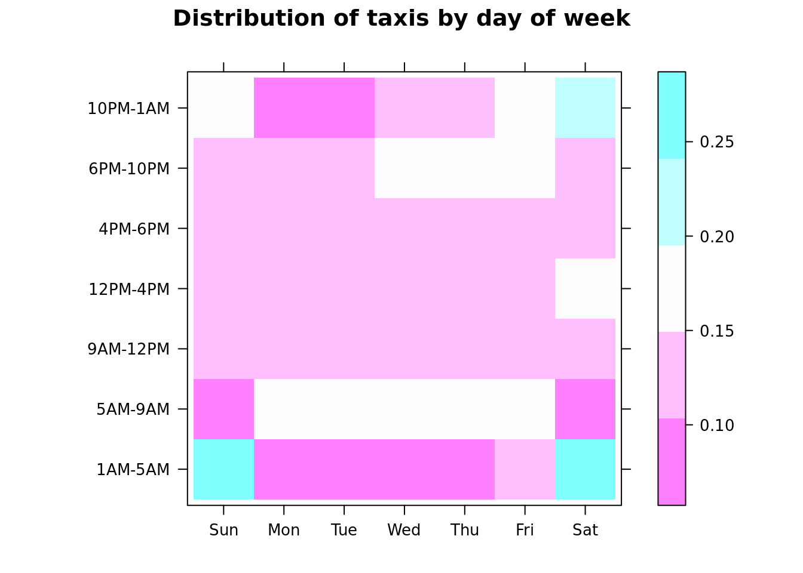
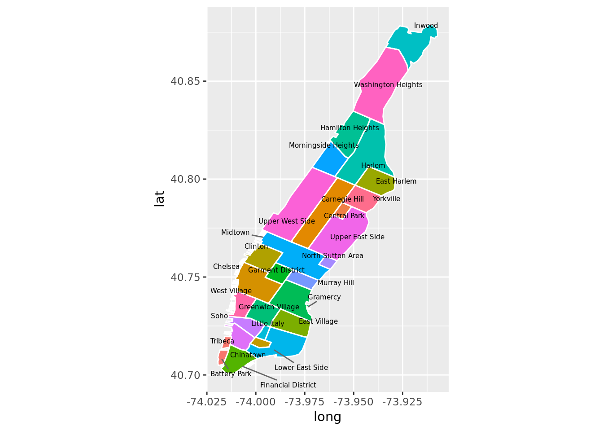
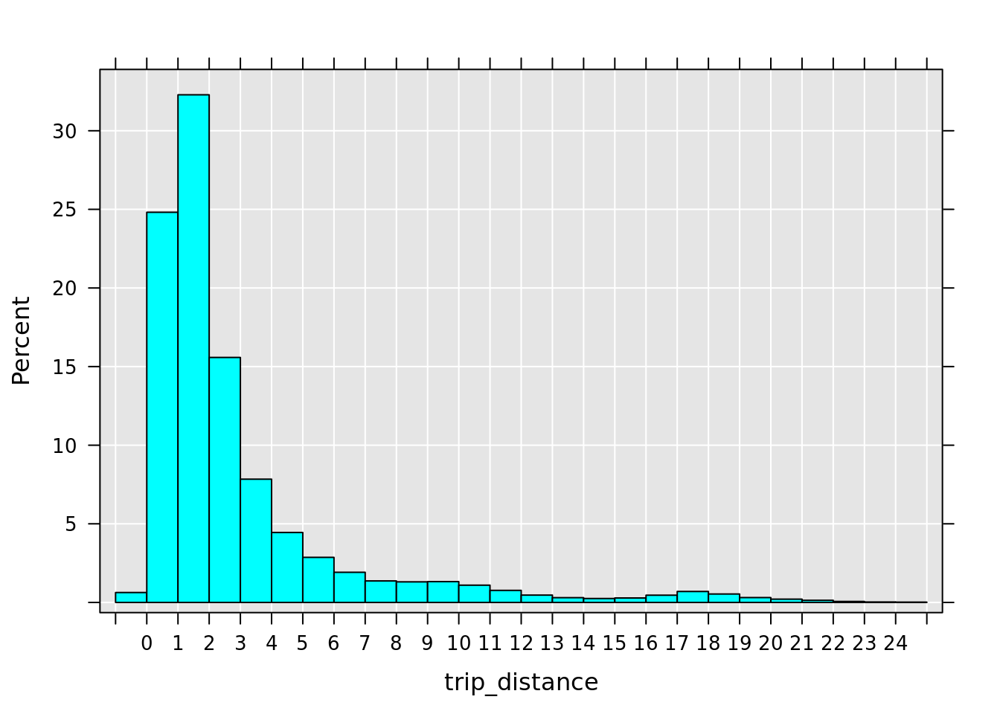
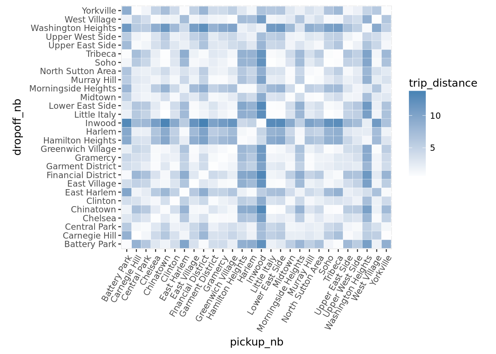
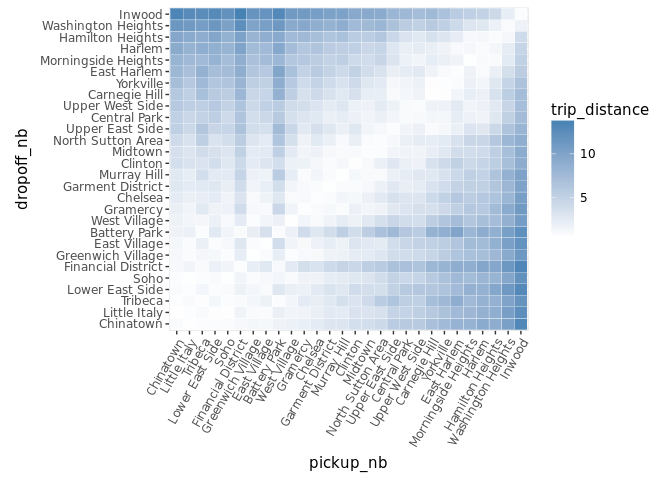
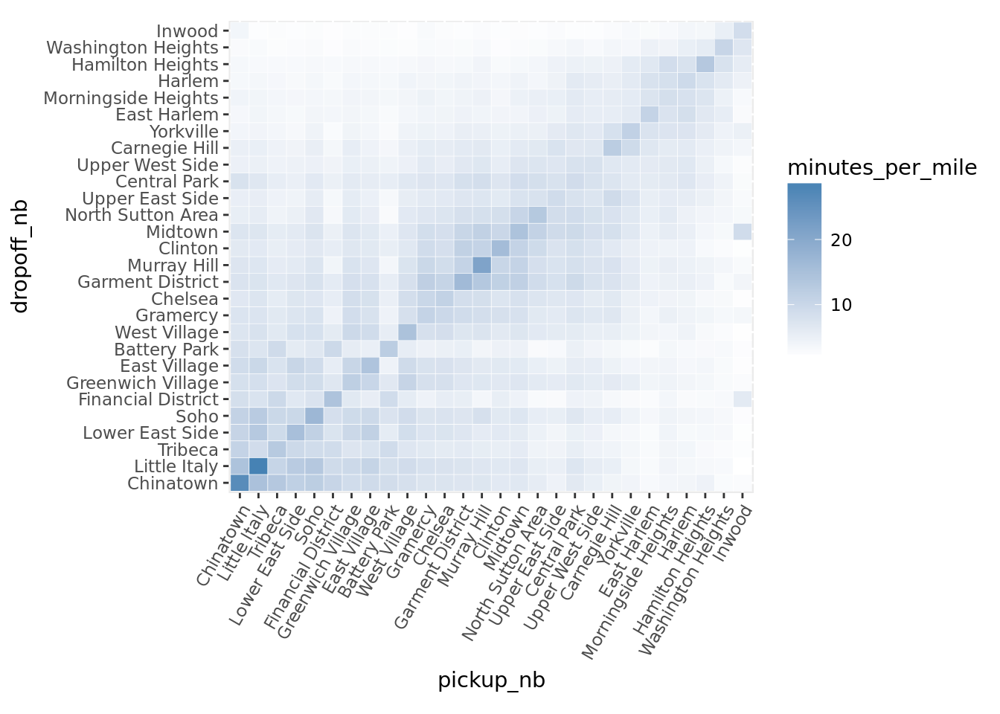
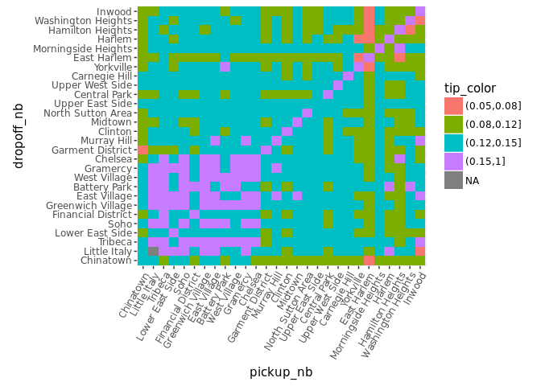
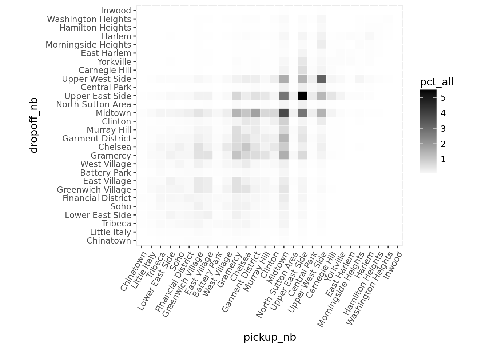
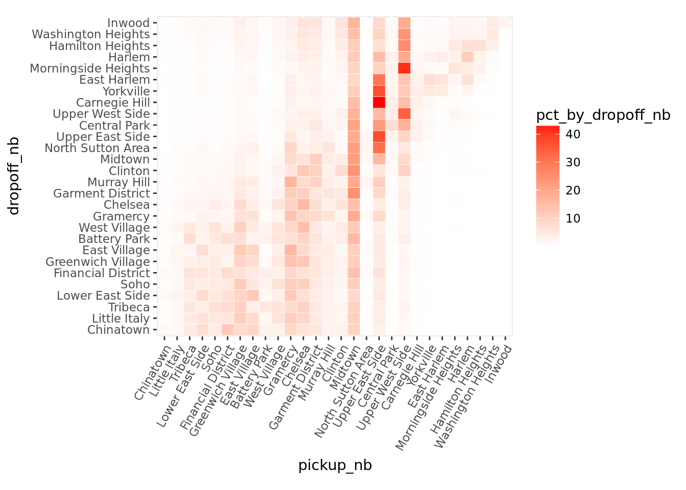
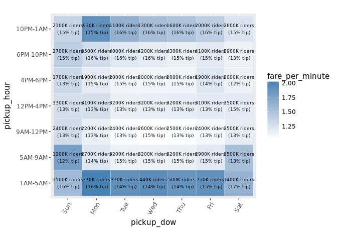

# Microsoft R Server on Spark Clusters
Ali Zaidi  


# Deploying to Spark Clusters on Azure HDInsight

## Azure HDInsight Spark Clusters

[Azure HDInsight](https://azure.microsoft.com/en-us/services/hdinsight/) is a managed Hadoop offering for the cloud. It provides enterprise ready Hadoop solutions without the hassle of installation, management, and configuration. Developers and data scientists can immediately create and deploy big data solutions on the cloud with the latest and greatest of the Hadoop ecosystem.

Dealing with data in distributed storage and programming with concurrent systems often requires learning complicated new paradigms and techniques. Statisticans and data scientists familiar wtih R are unlikely to have much experience with such systems. Fortunately, the `RevoScaleR` package abstracts away the difficult portions of distributed computation and allows the user to focus on building R code that can be automatically deployed in distributed environments.

As we will see in this module, we can reuse the majority of the code we developed in the previous sections that was meant to run locally, and have it deploy automagically in our new Spark environment. `RevoScaleR` will automatically transfer the computation from a single local machine to a network of concurrent systems.

## Loading Libraries

When working with MRS in distributed environments, we will need to install and load packages across the entire cluster, not just the current client node (edge node). 

In order to install a package across your HDInsight cluster, you will need to use a script action that you can deploy from the cluster's dashboard. See the instructions [here](https://docs.microsoft.com/en-us/azure/hdinsight/hdinsight-hadoop-r-server-get-started#install-r-packages). 

Before installing the packages, please run the following script action on all worker nodes: [install libgeos-dev](https://raw.githubusercontent.com/akzaidi/spark_nyc_taxi/master/libgeos_install.sh).

In order to run this chapter, you will to add the following parameters to packages installation installation script:

`useCRAN dplyr, stringr, lubridate, rgeos, sp, maptools, ggmap, ggplot2, gridExtra, ggrepel, tidyr, seriation`


```r
options(max.print = 1000, scipen = 999, width = 90, 
        continue = " ")
rxOptions(reportProgress = 3) # reduces the amount of output RevoScaleR produces
```


## Set Up HDFS Paths and Spark Context

In order to connect to HDFS, we have to set up pointers to our hadoop file system. In the of HDInsight clsuters, the file system is actually the fully HDFS-compatible Azure Blob Storage, and fortunately MRS makes it very easy to connect to with simple R statements. 

First, we will make pointers to our files as though they were on local storage.


```r
data_path <- file.path("/user/RevoShare/alizaidi")
taxi_path <- file.path(data_path, "nyctaxi/data")
hdfs_ls <- paste0("hadoop fs -ls ", taxi_path)
system(hdfs_ls)

taxi_xdf <- file.path(data_path, "TaxiXdf")

nyc_sample_df <- read.csv("data/yellow_tripdata_2016-05.csv", nrows = 1000)
```

Next, we will define a HDFS variable, which will tell RevoScaleR to look for the files under the Hadoop file system, not the local file system. Secondly, we will create our Spark context, which will tell MRS  to execute the computations on the Spark cluster. We will use all the default arguments, except for insisting that `RevoScaleR` reuse the existing Spark application whenever possible (the `persistentRun` parameter), and that Spark attempt to restart tasks that appear to be lagging (the `extraSparkConfig` value).


```r
myNameNode <- "default"
myPort <- 0
hdfsFS <- RxHdfsFileSystem(hostName = myNameNode, 
                           port = myPort)

taxi_text <- RxTextData(taxi_path, fileSystem = hdfsFS)
taxi_xdf <- RxXdfData(taxi_xdf, fileSystem = hdfsFS)

spark_cc <- RxSpark(
                    nameNode = myNameNode,
                    port = myPort,
                    persistentRun = TRUE, 
                    extraSparkConfig = "--conf spark.speculation=true"
                    )
                          

rxSetComputeContext(spark_cc)


system.time(rxImport(inData = taxi_text,
                     outFile = taxi_xdf))
```

```
##    user  system elapsed 
##   1.804   3.176 386.016
```

Now that we our pointers and environment variables for Spark set, we can immediately query our data just as before!


```r
rxGetInfo(taxi_xdf, getVarInfo = TRUE, numRows = 5)
```

```
## File name: /user/RevoShare/alizaidi/TaxiXdf 
## Number of composite data files: 48 
## Number of observations: 138413407 
## Number of variables: 19 
## Number of blocks: 289 
## Compression type: zlib 
## Variable information: 
## Var 1: VendorID, Type: integer, Low/High: (1, 2)
## Var 2: tpep_pickup_datetime, Type: character
## Var 3: tpep_dropoff_datetime, Type: character
## Var 4: passenger_count, Type: integer, Low/High: (0, 9)
## Var 5: trip_distance, Type: numeric, Storage: float32, Low/High: (-3390583.7500, 198623008.0000)
## Var 6: pickup_longitude, Type: numeric, Storage: float32, Low/High: (-736.6166, 172.6000)
## Var 7: pickup_latitude, Type: numeric, Storage: float32, Low/High: (-78.1947, 80.6025)
## Var 8: RatecodeID, Type: integer, Low/High: (1, 99)
## Var 9: store_and_fwd_flag, Type: character
## Var 10: dropoff_longitude, Type: numeric, Storage: float32, Low/High: (-781.8333, 172.6000)
## Var 11: dropoff_latitude, Type: numeric, Storage: float32, Low/High: (-78.1947, 480.7333)
## Var 12: payment_type, Type: integer, Low/High: (1, 5)
## Var 13: fare_amount, Type: numeric, Storage: float32, Low/High: (-957.6000, 825998.6250)
## Var 14: extra, Type: numeric, Storage: float32, Low/High: (-58.5000, 648.8700)
## Var 15: mta_tax, Type: numeric, Storage: float32, Low/High: (-3.0000, 91.0000)
## Var 16: tip_amount, Type: numeric, Storage: float32, Low/High: (-440.0000, 1200.8000)
## Var 17: tolls_amount, Type: numeric, Storage: float32, Low/High: (-99.9900, 1901.4000)
## Var 18: improvement_surcharge, Type: numeric, Storage: float32, Low/High: (-0.3000, 137.6300)
## Var 19: total_amount, Type: numeric, Storage: float32, Low/High: (-958.4000, 826040.0000)
## Data (5 rows starting with row 1):
##   VendorID tpep_pickup_datetime tpep_dropoff_datetime passenger_count
## 1        1  2015-07-01 00:00:00   2015-07-01 00:15:26               1
## 2        1  2015-07-01 00:00:00   2015-07-01 00:22:22               1
## 3        1  2015-07-01 00:00:00   2015-07-01 00:07:42               1
## 4        1  2015-07-01 00:00:00   2015-07-01 00:39:37               1
## 5        1  2015-07-01 00:00:00   2015-07-01 00:05:34               1
##   trip_distance pickup_longitude pickup_latitude RatecodeID
## 1           3.5        -73.99416        40.75113          1
## 2           3.9        -73.98466        40.76849          1
## 3           2.3        -73.97889        40.76229          1
## 4           9.2        -73.99279        40.74276          1
## 5           1.1        -73.91243        40.76981          1
##   store_and_fwd_flag dropoff_longitude dropoff_latitude payment_type
## 1                  N         -73.97682         40.78857            2
## 2                  N         -74.00013         40.73490            2
## 3                  N         -74.00422         40.75253            2
## 4                  N         -73.97151         40.63715            1
## 5                  N         -73.92033         40.75744            1
##   fare_amount extra mta_tax tip_amount tolls_amount improvement_surcharge
## 1          14   0.5     0.5       0.00            0                   0.3
## 2          17   0.5     0.5       0.00            0                   0.3
## 3           9   0.5     0.5       0.00            0                   0.3
## 4          33   0.5     0.5       8.55            0                   0.3
## 5           6   0.5     0.5       2.00            0                   0.3
##   total_amount
## 1        15.30
## 2        18.30
## 3        10.30
## 4        42.85
## 5         9.30
```

Observe the new field in the metadata section: **Number of composite data files: 48**. While previously we worked with XDF files, which were single file objects comprosing of multiple blocks, we are now working with blocked datasets that reside in distributed storage. Therefore, our data now has two layers of sharding: the first for the multiple of blocks per HDFS _chunk_, and multiple HDFS _chunks_ per data. We call such data XDFD, to emphasize it's distributed nature. This distinction won't be too important for you to understand as a developer, but is useful to keep in mind 

Even though the data is now saved across multiple nodes in a distributed environment, the data is compressed in order to improve read performance, and metadata is saved, improving querying time for simple statsitics.


```r
system.time(
  rxsum_xdf <- rxSummary( ~ fare_amount, taxi_xdf)
)
```

```
##    user  system elapsed 
##   0.444   0.432  42.425
```

```r
rxsum_xdf
```

```
## Call:
## rxSummary(formula = ~fare_amount, data = taxi_xdf)
## 
## Summary Statistics Results for: ~fare_amount
## Data: taxi_xdf (RxXdfData Data Source)
## File name: /user/RevoShare/alizaidi/TaxiXdf
## Number of valid observations: 138413407 
##  
##  Name        Mean     StdDev  Min    Max      ValidObs  MissingObs
##  fare_amount 13.04811 142.761 -957.6 825998.6 138413407 0
```


## Transformations with XDFDs

An important distinction with working with data stored in distributed file systems like HDFS in comparison to data residing on a single disk is it's _mutability_. In general, it's much more difficult to overwrite data in distributed storage, as it requires rewriting multiple non-contiguous blocks. 

Therefore, it is often better practice to write to a new location when working with XDFDs than to overwrite existing directories.


```r
taxi_tip <- RxXdfData("/user/RevoShare/alizaidi/taxitipXdf",
                      fileSystem = hdfsFS)

rxDataStep(taxi_xdf, taxi_tip,
           transforms = list(tip_percent = ifelse(fare_amount > 0, 
                                                  tip_amount/fare_amount,
                                                  NA)))


system.time(rxSummary( ~ tip_percent, taxi_tip))
```

```
##    user  system elapsed 
##   0.436   0.480  48.519
```


Similarly, we can do cross-tabulations and slightly more invovled trnasforms across the Spark cluster the same way we did in a local compute context:


```r
rxCrossTabs( ~ month:year, taxi_tip,
             transforms = list(
               year = as.integer(substr(tpep_pickup_datetime, 1, 4)),
               month = as.integer(substr(tpep_pickup_datetime, 6, 7)),
               year = factor(year, levels = 2014:2016),
               month = factor(month, levels = 1:12)))
```

```
## Call:
## rxCrossTabs(formula = ~month:year, data = taxi_tip, transforms = list(year = as.integer(substr(tpep_pickup_datetime, 
##     1, 4)), month = as.integer(substr(tpep_pickup_datetime, 6, 
##     7)), year = factor(year, levels = 2014:2016), month = factor(month, 
##     levels = 1:12)))
## 
## Cross Tabulation Results for: ~month:year
## Data: taxi_tip (RxXdfData Data Source)
## File name: /user/RevoShare/alizaidi/taxitipXdf
## Number of valid observations: 138413407
## Number of missing observations: 0 
## Statistic: counts 
##  
## month:year (counts):
##      year
## month 2014     2015     2016
##    1     0        0 10906858
##    2     0        0 11382049
##    3     0        0 12210952
##    4     0        0 11934338
##    5     0        0 11836853
##    6     0        0 11135470
##    7     0 11562783        0
##    8     0 11130304        0
##    9     0 11225063        0
##    10    0 12315488        0
##    11    0 11312676        0
##    12    0 11460573        0
```

If we want to utilize a function that depends on a R package that is not already installed in our cluster, including all worker nodes, we have to make sure we first install those packages. You can use the instructions [here](https://azure.microsoft.com/en-us/documentation/articles/hdinsight-hadoop-r-server-get-started/#install-r-packages) to install packages throughout your cluster using a script action. 


```r
rxCrossTabs( ~ month:year, taxi_tip,
             transforms = list(
               date = ymd_hms(tpep_pickup_datetime), 
               year = factor(year(date), levels = 2014:2016), 
               month = factor(month(date), levels = 1:12)), 
             transformPackages = "lubridate")
```

```
## Call:
## rxCrossTabs(formula = ~month:year, data = taxi_tip, transforms = list(date = ymd_hms(tpep_pickup_datetime), 
##     year = factor(year(date), levels = 2014:2016), month = factor(month(date), 
##         levels = 1:12)), transformPackages = "lubridate")
## 
## Cross Tabulation Results for: ~month:year
## Data: taxi_tip (RxXdfData Data Source)
## File name: /user/RevoShare/alizaidi/taxitipXdf
## Number of valid observations: 138413407
## Number of missing observations: 0 
## Statistic: counts 
##  
## month:year (counts):
##      year
## month 2014     2015     2016
##    1     0        0 10906858
##    2     0        0 11382049
##    3     0        0 12210952
##    4     0        0 11934338
##    5     0        0 11836853
##    6     0        0 11135470
##    7     0 11562783        0
##    8     0 11130304        0
##    9     0 11225063        0
##    10    0 12315488        0
##    11    0 11312676        0
##    12    0 11460573        0
```


## More Complicated Transforms

We saw in the previous sections how we could write our user-defined functions (UDFs) that we could apply to each chunk of our data to create new columns. This  greatly expands on the capabilities available for MRS on a Spark cluster.


```r
xforms <- function(data) { # transformation function for extracting some date and time features
  # require(lubridate)
  weekday_labels <- c('Sun', 'Mon', 'Tue', 'Wed', 'Thu', 'Fri', 'Sat')
  cut_levels <- c(1, 5, 9, 12, 16, 18, 22)
  hour_labels <- c('1AM-5AM', '5AM-9AM', '9AM-12PM', '12PM-4PM', '4PM-6PM', '6PM-10PM', '10PM-1AM')
  
  pickup_datetime <- lubridate::ymd_hms(data$tpep_pickup_datetime, tz = "UTC")
  pickup_hour <- addNA(cut(hour(pickup_datetime), cut_levels))
  pickup_dow <- factor(wday(pickup_datetime), levels = 1:7, labels = weekday_labels)
  levels(pickup_hour) <- hour_labels
  # 
  dropoff_datetime <- lubridate::ymd_hms(data$tpep_dropoff_datetime, tz = "UTC")
  dropoff_hour <- addNA(cut(hour(dropoff_datetime), cut_levels))
  dropoff_dow <- factor(wday(dropoff_datetime), levels = 1:7, labels = weekday_labels)
  levels(dropoff_hour) <- hour_labels
  # 
  data$pickup_hour <- pickup_hour
  data$pickup_dow <- pickup_dow
  data$dropoff_hour <- dropoff_hour
  data$dropoff_dow <- dropoff_dow
  data$trip_duration <- as.integer(lubridate::interval(pickup_datetime, dropoff_datetime))
  
  return(data)
}
```

We defined our function above, and now we apply it to our dataset. In order to ensure our function works on our data, we could try it out on a sample dataset locally first:


```r
x <- head(taxi_tip)
rxSetComputeContext("local")

rxDataStep(inData = x, 
           outFile = NULL, 
           transformFunc = xforms, 
           transformPackages = "lubridate")
```

```
## Rows Read: 6, Total Rows Processed: 6, Total Chunk Time: 0.018 seconds
```

```
##   VendorID tpep_pickup_datetime tpep_dropoff_datetime passenger_count
## 1        1  2015-07-01 00:00:00   2015-07-01 00:15:26               1
## 2        1  2015-07-01 00:00:00   2015-07-01 00:22:22               1
## 3        1  2015-07-01 00:00:00   2015-07-01 00:07:42               1
## 4        1  2015-07-01 00:00:00   2015-07-01 00:39:37               1
## 5        1  2015-07-01 00:00:00   2015-07-01 00:05:34               1
## 6        1  2015-07-01 00:00:00   2015-07-01 00:06:46               2
##   trip_distance pickup_longitude pickup_latitude RatecodeID
## 1           3.5        -73.99416        40.75113          1
## 2           3.9        -73.98466        40.76849          1
## 3           2.3        -73.97889        40.76229          1
## 4           9.2        -73.99279        40.74276          1
## 5           1.1        -73.91243        40.76981          1
## 6           1.0        -73.95916        40.77343          1
##   store_and_fwd_flag dropoff_longitude dropoff_latitude payment_type
## 1                  N         -73.97682         40.78857            2
## 2                  N         -74.00013         40.73490            2
## 3                  N         -74.00422         40.75253            2
## 4                  N         -73.97151         40.63715            1
## 5                  N         -73.92033         40.75744            1
## 6                  N         -73.96935         40.76925            2
##   fare_amount extra mta_tax tip_amount tolls_amount improvement_surcharge
## 1        14.0   0.5     0.5       0.00            0                   0.3
## 2        17.0   0.5     0.5       0.00            0                   0.3
## 3         9.0   0.5     0.5       0.00            0                   0.3
## 4        33.0   0.5     0.5       8.55            0                   0.3
## 5         6.0   0.5     0.5       2.00            0                   0.3
## 6         6.5   0.5     0.5       0.00            0                   0.3
##   total_amount tip_percent pickup_hour pickup_dow dropoff_hour dropoff_dow
## 1        15.30   0.0000000    10PM-1AM        Wed     10PM-1AM         Wed
## 2        18.30   0.0000000    10PM-1AM        Wed     10PM-1AM         Wed
## 3        10.30   0.0000000    10PM-1AM        Wed     10PM-1AM         Wed
## 4        42.85   0.2590909    10PM-1AM        Wed     10PM-1AM         Wed
## 5         9.30   0.3333333    10PM-1AM        Wed     10PM-1AM         Wed
## 6         7.80   0.0000000    10PM-1AM        Wed     10PM-1AM         Wed
##   trip_duration
## 1           926
## 2          1342
## 3           462
## 4          2377
## 5           334
## 6           406
```

```r
rxSetComputeContext(spark_cc)
```

We used a local compute context to try our function on the sample locally, then reverted to the spark context for doing our analysis on the cluster.


```r
taxi_date <- RxXdfData("/user/RevoShare/alizaidi/TaxiDatesTranf",
                       fileSystem = hdfsFS)
```


```r
rxDataStep(inData = taxi_tip, 
           outFile = taxi_date, 
           transformFunc = xforms, 
           transformPackages = "lubridate")
```


```r
rxGetInfo(taxi_date, numRows = 5, getVarInfo = TRUE)
```

```
## File name: /user/RevoShare/alizaidi/TaxiDatesTranf 
## Number of composite data files: 48 
## Number of observations: 138413407 
## Number of variables: 25 
## Number of blocks: 289 
## Compression type: zlib 
## Variable information: 
## Var 1: VendorID, Type: integer, Low/High: (1, 2)
## Var 2: tpep_pickup_datetime, Type: character
## Var 3: tpep_dropoff_datetime, Type: character
## Var 4: passenger_count, Type: integer, Low/High: (0, 9)
## Var 5: trip_distance, Type: numeric, Storage: float32, Low/High: (-3390583.7500, 198623008.0000)
## Var 6: pickup_longitude, Type: numeric, Storage: float32, Low/High: (-736.6166, 172.6000)
## Var 7: pickup_latitude, Type: numeric, Storage: float32, Low/High: (-78.1947, 80.6025)
## Var 8: RatecodeID, Type: integer, Low/High: (1, 99)
## Var 9: store_and_fwd_flag, Type: character
## Var 10: dropoff_longitude, Type: numeric, Storage: float32, Low/High: (-781.8333, 172.6000)
## Var 11: dropoff_latitude, Type: numeric, Storage: float32, Low/High: (-78.1947, 480.7333)
## Var 12: payment_type, Type: integer, Low/High: (1, 5)
## Var 13: fare_amount, Type: numeric, Storage: float32, Low/High: (-957.6000, 825998.6250)
## Var 14: extra, Type: numeric, Storage: float32, Low/High: (-58.5000, 648.8700)
## Var 15: mta_tax, Type: numeric, Storage: float32, Low/High: (-3.0000, 91.0000)
## Var 16: tip_amount, Type: numeric, Storage: float32, Low/High: (-440.0000, 1200.8000)
## Var 17: tolls_amount, Type: numeric, Storage: float32, Low/High: (-99.9900, 1901.4000)
## Var 18: improvement_surcharge, Type: numeric, Storage: float32, Low/High: (-0.3000, 137.6300)
## Var 19: total_amount, Type: numeric, Storage: float32, Low/High: (-958.4000, 826040.0000)
## Var 20: tip_percent, Type: numeric, Low/High: (-1.0000, 54900.0012)
## Var 21: pickup_hour
##        7 factor levels: 1AM-5AM 5AM-9AM 9AM-12PM 12PM-4PM 4PM-6PM 6PM-10PM 10PM-1AM
## Var 22: pickup_dow
##        7 factor levels: Sun Mon Tue Wed Thu Fri Sat
## Var 23: dropoff_hour
##        7 factor levels: 1AM-5AM 5AM-9AM 9AM-12PM 12PM-4PM 4PM-6PM 6PM-10PM 10PM-1AM
## Var 24: dropoff_dow
##        7 factor levels: Sun Mon Tue Wed Thu Fri Sat
## Var 25: trip_duration, Type: integer, Low/High: (-631148790, 29227264)
## Data (5 rows starting with row 1):
##   VendorID tpep_pickup_datetime tpep_dropoff_datetime passenger_count
## 1        1  2015-07-01 00:00:00   2015-07-01 00:15:26               1
## 2        1  2015-07-01 00:00:00   2015-07-01 00:22:22               1
## 3        1  2015-07-01 00:00:00   2015-07-01 00:07:42               1
## 4        1  2015-07-01 00:00:00   2015-07-01 00:39:37               1
## 5        1  2015-07-01 00:00:00   2015-07-01 00:05:34               1
##   trip_distance pickup_longitude pickup_latitude RatecodeID
## 1           3.5        -73.99416        40.75113          1
## 2           3.9        -73.98466        40.76849          1
## 3           2.3        -73.97889        40.76229          1
## 4           9.2        -73.99279        40.74276          1
## 5           1.1        -73.91243        40.76981          1
##   store_and_fwd_flag dropoff_longitude dropoff_latitude payment_type
## 1                  N         -73.97682         40.78857            2
## 2                  N         -74.00013         40.73490            2
## 3                  N         -74.00422         40.75253            2
## 4                  N         -73.97151         40.63715            1
## 5                  N         -73.92033         40.75744            1
##   fare_amount extra mta_tax tip_amount tolls_amount improvement_surcharge
## 1          14   0.5     0.5       0.00            0                   0.3
## 2          17   0.5     0.5       0.00            0                   0.3
## 3           9   0.5     0.5       0.00            0                   0.3
## 4          33   0.5     0.5       8.55            0                   0.3
## 5           6   0.5     0.5       2.00            0                   0.3
##   total_amount tip_percent pickup_hour pickup_dow dropoff_hour dropoff_dow
## 1        15.30   0.0000000    10PM-1AM        Wed     10PM-1AM         Wed
## 2        18.30   0.0000000    10PM-1AM        Wed     10PM-1AM         Wed
## 3        10.30   0.0000000    10PM-1AM        Wed     10PM-1AM         Wed
## 4        42.85   0.2590909    10PM-1AM        Wed     10PM-1AM         Wed
## 5         9.30   0.3333333    10PM-1AM        Wed     10PM-1AM         Wed
##   trip_duration
## 1           926
## 2          1342
## 3           462
## 4          2377
## 5           334
```


## Tabulate Counts by Day of Week and Hour

In order to get a sense of the distribution of counts, let's use `rxSummary` to tabulate the counts of trips by day of week and by pickup hour.


```r
rxs1 <- rxSummary( ~ pickup_hour + pickup_dow + trip_duration, taxi_date)
# we can add a column for proportions next to the counts
rxs1$categorical <- lapply(rxs1$categorical, 
                           function(x) cbind(x, prop =round(prop.table(x$Counts), 2)))
rxs1
```

```
## Call:
## rxSummary(formula = ~pickup_hour + pickup_dow + trip_duration, 
##     data = taxi_date)
## 
## Summary Statistics Results for: ~pickup_hour + pickup_dow +
##     trip_duration
## Data: taxi_date (RxXdfData Data Source)
## File name: /user/RevoShare/alizaidi/TaxiDatesTranf
## Number of valid observations: 138413407 
##  
##  Name          Mean     StdDev   Min        Max      ValidObs  MissingObs
##  trip_duration 943.0364 88419.66 -631148790 29227264 138413405 2         
## 
## Category Counts for pickup_hour
## Number of categories: 7
## Number of valid observations: 138413407
## Number of missing observations: 0
## 
##  pickup_hour Counts   prop
##  1AM-5AM      7806258 0.06
##  5AM-9AM     20901140 0.15
##  9AM-12PM    19532254 0.14
##  12PM-4PM    26733342 0.19
##  4PM-6PM     15569260 0.11
##  6PM-10PM    32235206 0.23
##  10PM-1AM    15635947 0.11
## 
## Category Counts for pickup_dow
## Number of categories: 7
## Number of valid observations: 138413407
## Number of missing observations: 0
## 
##  pickup_dow Counts   prop
##  Sun        18596548 0.13
##  Mon        17837556 0.13
##  Tue        19304158 0.14
##  Wed        20287441 0.15
##  Thu        20754418 0.15
##  Fri        20762408 0.15
##  Sat        20870878 0.15
```

```r
rxs2 <- rxSummary( ~ pickup_dow:pickup_hour, taxi_date)
rxs2 <- tidyr::spread(rxs2$categorical[[1]], key = 'pickup_hour', value = 'Counts')
row.names(rxs2) <- rxs2[ , 1]
rxs2 <- as.matrix(rxs2[ , -1])
rxs2
```

```
##     1AM-5AM 5AM-9AM 9AM-12PM 12PM-4PM 4PM-6PM 6PM-10PM 10PM-1AM
## Sun 2130664 1492981  2760776  3928348 2030550  3443306  2809923
## Mon  609012 3223524  2545550  3647412 2223534  4240647  1347877
## Tue  578949 3608877  2785066  3737400 2262601  4791170  1540095
## Wed  676308 3685648  2906996  3805880 2280082  5080753  1851774
## Thu  770857 3658090  2887979  3827390 2268847  5200092  2141163
## Fri 1084527 3382232  2757791  3720367 2254199  4925703  2637589
## Sat 1955941 1849788  2888096  4066545 2249447  4553535  3307526
```

```r
levelplot(prop.table(rxs2, 2), cuts = 4, xlab = "", ylab = "", 
          main = "Distribution of taxis by day of week")
```



## Join in Neighborhoods from Shapefile

Just as we did in the prior chapters, we will add in categorical features of the neighborhoods related to our dataset, by merging in the data from a shapefile containing New York city data. 


```r
library(rgeos)
library(sp)
library(maptools)
library(stringr)
library(ggplot2)

nyc_shapefile <- readShapePoly('ZillowNeighborhoods-NY/ZillowNeighborhoods-NY.shp')
mht_shapefile <- subset(nyc_shapefile, str_detect(CITY, 'New York City-Manhattan'))

mht_shapefile@data$id <- as.character(mht_shapefile@data$NAME)
mht.points <- fortify(gBuffer(mht_shapefile, byid = TRUE, width = 0), region = "NAME")

library(dplyr)
mht.df <- inner_join(mht.points, mht_shapefile@data, by = "id")
mht.cent <- mht.df %>%
  group_by(id) %>%
  summarize(long = median(long), lat = median(lat))

library(ggrepel)
ggplot(mht.df, aes(long, lat, fill = id)) + 
  geom_polygon() +
  geom_path(color = "white") +
  coord_equal() +
  theme(legend.position = "none") +
  geom_text_repel(aes(label = id), data = mht.cent, size = 2)
```




```r
data_coords <- transmute(nyc_sample_df,
                         long = ifelse(is.na(pickup_longitude), 0, pickup_longitude),
                         lat = ifelse(is.na(pickup_latitude), 0, pickup_latitude)
)
# we specify the columns that correspond to the coordinates
coordinates(data_coords) <- c('long', 'lat')
# returns the neighborhoods based on coordinates
nhoods <- over(data_coords, mht_shapefile)
# rename the column names in nhoods
names(nhoods) <- paste('pickup', tolower(names(nhoods)), sep = '_')
# combine the neighborhood information with the original data
nyc_sample_df <- cbind(nyc_sample_df, nhoods[, grep('name|city', names(nhoods))])
head(nyc_sample_df)
```

```
##   VendorID tpep_pickup_datetime tpep_dropoff_datetime passenger_count
## 1        1  2016-05-01 00:00:00   2016-05-01 00:17:31               1
## 2        2  2016-05-01 00:00:00   2016-05-01 00:07:31               1
## 3        2  2016-05-01 00:00:00   2016-05-01 00:07:01               6
## 4        2  2016-05-01 00:00:00   2016-05-01 00:19:47               1
## 5        2  2016-05-01 00:00:00   2016-05-01 00:06:39               1
## 6        2  2016-05-01 00:00:00   2016-05-01 00:05:19               2
##   trip_distance pickup_longitude pickup_latitude RatecodeID
## 1          3.60        -73.98590        40.76804          1
## 2          1.68        -73.99158        40.74475          1
## 3          1.09        -73.99307        40.74157          1
## 4          4.21        -73.99194        40.68460          1
## 5          0.56        -74.00528        40.74019          1
## 6          0.63        -73.97929        40.75576          1
##   store_and_fwd_flag dropoff_longitude dropoff_latitude payment_type
## 1                  N         -73.98399         40.73010            1
## 2                  N         -73.97570         40.76547            1
## 3                  N         -73.98100         40.74463            1
## 4                  N         -74.00226         40.73300            1
## 5                  N         -73.99750         40.73756            1
## 6                  N         -73.98801         40.75847            1
##   fare_amount extra mta_tax tip_amount tolls_amount improvement_surcharge
## 1        15.0   0.5     0.5       1.50            0                   0.3
## 2         7.5   0.5     0.5       0.88            0                   0.3
## 3         6.5   0.5     0.5       1.56            0                   0.3
## 4        17.0   0.5     0.5       3.66            0                   0.3
## 5         6.0   0.5     0.5       1.46            0                   0.3
## 6         5.0   0.5     0.5       0.00            0                   0.3
##   total_amount             pickup_city  pickup_name
## 1        17.80 New York City-Manhattan      Midtown
## 2         9.68 New York City-Manhattan      Chelsea
## 3         9.36 New York City-Manhattan      Chelsea
## 4        21.96                    <NA>         <NA>
## 5         8.76 New York City-Manhattan West Village
## 6         6.30 New York City-Manhattan      Midtown
```

Let's create our merge function and ensure that it works with our sample `data.frame` in a local compute context. 


```r
find_nhoods <- function(data) {
  
  # extract pick-up lat and long and find their neighborhoods
  pickup_longitude <- ifelse(is.na(data$pickup_longitude), 0, data$pickup_longitude)
  pickup_latitude <- ifelse(is.na(data$pickup_latitude), 0, data$pickup_latitude)
  data_coords <- data.frame(long = pickup_longitude, lat = pickup_latitude)
  coordinates(data_coords) <- c('long', 'lat')
  nhoods <- over(data_coords, shapefile)
  
  ## add only the pick-up neighborhood and city columns to the data
  data$pickup_nhood <- nhoods$NAME
  data$pickup_borough <- nhoods$CITY
  
  # extract drop-off lat and long and find their neighborhoods
  dropoff_longitude <- ifelse(is.na(data$dropoff_longitude), 0, data$dropoff_longitude)
  dropoff_latitude <- ifelse(is.na(data$dropoff_latitude), 0, data$dropoff_latitude)
  data_coords <- data.frame(long = dropoff_longitude, lat = dropoff_latitude)
  coordinates(data_coords) <- c('long', 'lat')
  nhoods <- over(data_coords, shapefile)
  
  ## add only the drop-off neighborhood and city columns to the data  
  data$dropoff_nhood <- nhoods$NAME
  data$dropoff_borough <- nhoods$CITY
  
  ## return the data with the new columns added in
  data
}

# test the function on a data.frame using rxDataStep

rxSetComputeContext("local")
head(rxDataStep(nyc_sample_df, transformFunc = find_nhoods, transformPackages = c("sp", "maptools"), 
                transformObjects = list(shapefile = mht_shapefile)))
```

```
## Rows Read: 1000, Total Rows Processed: 1000, Total Chunk Time: 0.049 seconds
```

```
##   VendorID tpep_pickup_datetime tpep_dropoff_datetime passenger_count
## 1        1  2016-05-01 00:00:00   2016-05-01 00:17:31               1
## 2        2  2016-05-01 00:00:00   2016-05-01 00:07:31               1
## 3        2  2016-05-01 00:00:00   2016-05-01 00:07:01               6
## 4        2  2016-05-01 00:00:00   2016-05-01 00:19:47               1
## 5        2  2016-05-01 00:00:00   2016-05-01 00:06:39               1
## 6        2  2016-05-01 00:00:00   2016-05-01 00:05:19               2
##   trip_distance pickup_longitude pickup_latitude RatecodeID
## 1          3.60        -73.98590        40.76804          1
## 2          1.68        -73.99158        40.74475          1
## 3          1.09        -73.99307        40.74157          1
## 4          4.21        -73.99194        40.68460          1
## 5          0.56        -74.00528        40.74019          1
## 6          0.63        -73.97929        40.75576          1
##   store_and_fwd_flag dropoff_longitude dropoff_latitude payment_type
## 1                  N         -73.98399         40.73010            1
## 2                  N         -73.97570         40.76547            1
## 3                  N         -73.98100         40.74463            1
## 4                  N         -74.00226         40.73300            1
## 5                  N         -73.99750         40.73756            1
## 6                  N         -73.98801         40.75847            1
##   fare_amount extra mta_tax tip_amount tolls_amount improvement_surcharge
## 1        15.0   0.5     0.5       1.50            0                   0.3
## 2         7.5   0.5     0.5       0.88            0                   0.3
## 3         6.5   0.5     0.5       1.56            0                   0.3
## 4        17.0   0.5     0.5       3.66            0                   0.3
## 5         6.0   0.5     0.5       1.46            0                   0.3
## 6         5.0   0.5     0.5       0.00            0                   0.3
##   total_amount             pickup_city  pickup_name pickup_nhood
## 1        17.80 New York City-Manhattan      Midtown      Midtown
## 2         9.68 New York City-Manhattan      Chelsea      Chelsea
## 3         9.36 New York City-Manhattan      Chelsea      Chelsea
## 4        21.96                    <NA>         <NA>         <NA>
## 5         8.76 New York City-Manhattan West Village West Village
## 6         6.30 New York City-Manhattan      Midtown      Midtown
##            pickup_borough     dropoff_nhood         dropoff_borough
## 1 New York City-Manhattan      East Village New York City-Manhattan
## 2 New York City-Manhattan      Central Park New York City-Manhattan
## 3 New York City-Manhattan          Gramercy New York City-Manhattan
## 4                    <NA> Greenwich Village New York City-Manhattan
## 5 New York City-Manhattan Greenwich Village New York City-Manhattan
## 6 New York City-Manhattan           Midtown New York City-Manhattan
```

```r
rxSetComputeContext(spark_cc)
```

Then we will go ahead and deploy it across our cluster in a Spark compute context:


```r
taxi_hoods <- RxXdfData("/user/RevoShare/alizaidi/TaxiHoodsXdf",
                       fileSystem = hdfsFS)

st <- Sys.time()
rxDataStep(taxi_date, taxi_hoods, 
           transformFunc = find_nhoods, 
           transformPackages = c("sp", "maptools", "rgeos"), 
           transformObjects = list(shapefile = mht_shapefile))
Sys.time() - st
```

```
## Time difference of 7.93051 mins
```

```r
rxGetInfo(taxi_hoods, numRows = 5)
```

```
## File name: /user/RevoShare/alizaidi/TaxiHoodsXdf 
## Number of composite data files: 48 
## Number of observations: 138413407 
## Number of variables: 29 
## Number of blocks: 289 
## Compression type: zlib 
## Data (5 rows starting with row 1):
##   VendorID tpep_pickup_datetime tpep_dropoff_datetime passenger_count
## 1        1  2015-07-01 00:00:00   2015-07-01 00:15:26               1
## 2        1  2015-07-01 00:00:00   2015-07-01 00:22:22               1
## 3        1  2015-07-01 00:00:00   2015-07-01 00:07:42               1
## 4        1  2015-07-01 00:00:00   2015-07-01 00:39:37               1
## 5        1  2015-07-01 00:00:00   2015-07-01 00:05:34               1
##   trip_distance pickup_longitude pickup_latitude RatecodeID
## 1           3.5        -73.99416        40.75113          1
## 2           3.9        -73.98466        40.76849          1
## 3           2.3        -73.97889        40.76229          1
## 4           9.2        -73.99279        40.74276          1
## 5           1.1        -73.91243        40.76981          1
##   store_and_fwd_flag dropoff_longitude dropoff_latitude payment_type
## 1                  N         -73.97682         40.78857            2
## 2                  N         -74.00013         40.73490            2
## 3                  N         -74.00422         40.75253            2
## 4                  N         -73.97151         40.63715            1
## 5                  N         -73.92033         40.75744            1
##   fare_amount extra mta_tax tip_amount tolls_amount improvement_surcharge
## 1          14   0.5     0.5       0.00            0                   0.3
## 2          17   0.5     0.5       0.00            0                   0.3
## 3           9   0.5     0.5       0.00            0                   0.3
## 4          33   0.5     0.5       8.55            0                   0.3
## 5           6   0.5     0.5       2.00            0                   0.3
##   total_amount tip_percent pickup_hour pickup_dow dropoff_hour dropoff_dow
## 1        15.30   0.0000000    10PM-1AM        Wed     10PM-1AM         Wed
## 2        18.30   0.0000000    10PM-1AM        Wed     10PM-1AM         Wed
## 3        10.30   0.0000000    10PM-1AM        Wed     10PM-1AM         Wed
## 4        42.85   0.2590909    10PM-1AM        Wed     10PM-1AM         Wed
## 5         9.30   0.3333333    10PM-1AM        Wed     10PM-1AM         Wed
##   trip_duration     pickup_nhood          pickup_borough     dropoff_nhood
## 1           926 Garment District New York City-Manhattan   Upper West Side
## 2          1342          Midtown New York City-Manhattan Greenwich Village
## 3           462          Midtown New York City-Manhattan           Chelsea
## 4          2377          Chelsea New York City-Manhattan              <NA>
## 5           334             <NA>                    <NA>              <NA>
##           dropoff_borough
## 1 New York City-Manhattan
## 2 New York City-Manhattan
## 3 New York City-Manhattan
## 4                    <NA>
## 5                    <NA>
```


```r
system.time(
  rxs_all <- rxSummary( ~ ., taxi_hoods)
)
```

```
##    user  system elapsed 
##   0.464   0.876  44.699
```

```r
head(rxs_all$sDataFrame)
```

```
##                    Name       Mean       StdDev           Min         Max
## 1              VendorID   1.529642 4.991206e-01        1.0000         2.0
## 2  tpep_pickup_datetime         NA           NA            NA          NA
## 3 tpep_dropoff_datetime         NA           NA            NA          NA
## 4       passenger_count   1.672253 1.320966e+00        0.0000         9.0
## 5         trip_distance   7.300553 1.756544e+04 -3390583.7500 198623008.0
## 6      pickup_longitude -72.925354 8.744200e+00     -736.6166       172.6
##    ValidObs MissingObs
## 1 138413407          0
## 2         0          0
## 3         0          0
## 4 138413407          0
## 5 138413407          0
## 6 138413407          0
```

```r
nhoods_by_borough <- rxCrossTabs( ~ pickup_nhood:pickup_borough, taxi_hoods)
nhoods_by_borough <- nhoods_by_borough$counts[[1]]
nhoods_by_borough <- as.data.frame(nhoods_by_borough)

# get the neighborhoods by borough
lnbs <- lapply(names(nhoods_by_borough), 
               function(vv) subset(nhoods_by_borough, 
                                   nhoods_by_borough[ , vv] > 0, 
                                   select = vv, drop = FALSE))
lapply(lnbs, head)
```

```
## [[1]]
## [1] Albany
## <0 rows> (or 0-length row.names)
## 
## [[2]]
## [1] Buffalo
## <0 rows> (or 0-length row.names)
## 
## [[3]]
## [1] New York City-Bronx
## <0 rows> (or 0-length row.names)
## 
## [[4]]
## [1] New York City-Brooklyn
## <0 rows> (or 0-length row.names)
## 
## [[5]]
##               New York City-Manhattan
## Battery Park                  1282503
## Carnegie Hill                 1532962
## Central Park                  1882914
## Chelsea                       9237282
## Chinatown                      438817
## Clinton                       4213741
## 
## [[6]]
## [1] New York City-Queens
## <0 rows> (or 0-length row.names)
## 
## [[7]]
## [1] New York City-Staten Island
## <0 rows> (or 0-length row.names)
## 
## [[8]]
## [1] Rochester
## <0 rows> (or 0-length row.names)
## 
## [[9]]
## [1] Syracuse
## <0 rows> (or 0-length row.names)
```

## Filter to Manhattan Neighborhoods

The majority of the data lies in the borough of Manhattan. Let's go ahead and refactor our neighborhoood columns to exclude any non-Manhattan pickup and dropoff rides.


```r
manhattan_nhoods <- rownames(nhoods_by_borough)[nhoods_by_borough$`New York City-Manhattan` > 0]

refactor_columns <- function(dataList) {
  dataList$pickup_nb = factor(dataList$pickup_nhood, levels = nhoods_levels)
  dataList$dropoff_nb = factor(dataList$dropoff_nhood, levels = nhoods_levels)
  dataList
}

mht_hoods <- RxXdfData("/user/RevoShare/alizaidi/MhtHoodsXdf",
                       fileSystem = hdfsFS)

system.time(rxDataStep(taxi_hoods, mht_hoods, 
           transformFunc = refactor_columns,
           transformObjects = list(nhoods_levels = manhattan_nhoods)))
```

```
##    user  system elapsed 
##   2.100   6.428 396.368
```

```r
system.time(rxs_pickdrop <- rxSummary( ~ pickup_nb:dropoff_nb, mht_hoods))
```

```
##    user  system elapsed 
##   0.452   0.636  30.343
```

```r
head(rxs_pickdrop$categorical[[1]])
```

```
##       pickup_nb   dropoff_nb Counts
## 1  Battery Park Battery Park  39435
## 2 Carnegie Hill Battery Park   5148
## 3  Central Park Battery Park   7585
## 4       Chelsea Battery Park 122936
## 5     Chinatown Battery Park   7851
## 6       Clinton Battery Park  52650
```

```r
system.time(rxHistogram( ~ trip_distance, 
             mht_hoods, startVal = 0, endVal = 25, histType = "Percent", numBreaks = 20))
```



```
##    user  system elapsed 
##   1.400   1.232  57.149
```

```r
system.time(rxs <- rxSummary( ~ pickup_nhood:dropoff_nhood, 
                  mht_hoods, 
                  rowSelection = (trip_distance > 15 & trip_distance < 22)))
```

```
##    user  system elapsed 
##   0.972   0.836  37.138
```

```r
head(arrange(rxs$categorical[[1]], desc(Counts)), 10)
```

```
##          pickup_nhood      dropoff_nhood Counts
## 1             Midtown            Midtown   2048
## 2     Upper East Side    Upper East Side    920
## 3     Upper West Side    Upper West Side    607
## 4            Gramercy           Gramercy    585
## 5             Chelsea            Chelsea    460
## 6    Garment District   Garment District    388
## 7         Murray Hill        Murray Hill    373
## 8             Clinton            Clinton    341
## 9  Financial District Financial District    291
## 10    Lower East Side    Lower East Side    259
```


### Filter Data to Manhattan Only

Now that our dataset has encoded `NA` for the non-Manhattan rides, we can filter out those rides as well as other _outlier_ rides.


```r
mht_xdf <- RxXdfData("/user/RevoShare/alizaidi/ManhattanXdf",
                     fileSystem = hdfsFS)

st <- Sys.time()
rxDataStep(mht_hoods, mht_xdf, 
           rowSelection = (
             passenger_count > 0 &
               trip_distance >= 0 & trip_distance < 30 &
               trip_duration > 0 & trip_duration < 60*60*24 &
               str_detect(pickup_borough, 'Manhattan') &
               str_detect(dropoff_borough, 'Manhattan') &
               !is.na(pickup_nb) &
               !is.na(dropoff_nb) &
               fare_amount > 0), 
           transformPackages = "stringr",
           varsToDrop = c('extra', 'mta_tax', 'improvement_surcharge', 'total_amount', 
                          'pickup_borough', 'dropoff_borough', 'pickup_nhood', 'dropoff_nhood'))

Sys.time() - st
```

```
## Time difference of 1.782435 mins
```

## Visualize Trip Routes

Let's make some visualizations of taxi rides.


```r
system.time(rxct <- rxCrossTabs(trip_distance ~ pickup_nb:dropoff_nb, mht_xdf))
```

```
##    user  system elapsed 
##   0.456   0.640  26.394
```

```r
res <- rxct$sums$trip_distance / rxct$counts$trip_distance

library(seriation)
res[which(is.nan(res))] <- mean(res, na.rm = TRUE)
nb_order <- seriate(res)

system.time(rxc1 <- rxCube(trip_distance ~ pickup_nb:dropoff_nb, mht_xdf))
```

```
##    user  system elapsed 
##   0.388   0.708  26.401
```

```r
system.time(rxc2 <- rxCube(minutes_per_mile ~ pickup_nb:dropoff_nb, mht_xdf,
               transforms = list(minutes_per_mile = (trip_duration / 60) / trip_distance)))
```

```
##    user  system elapsed 
##   0.948   0.780  33.072
```

```r
system.time(rxc3 <- rxCube(tip_percent ~ pickup_nb:dropoff_nb, mht_xdf))
```

```
##    user  system elapsed 
##   0.396   0.664  24.390
```

```r
res <- bind_cols(list(rxc1, rxc2, rxc3))
res <- res[, c('pickup_nb', 'dropoff_nb', 
               'trip_distance', 'minutes_per_mile', 'tip_percent')]
head(res)
```

```
## # A tibble: 6 × 5
##       pickup_nb   dropoff_nb trip_distance minutes_per_mile tip_percent
##          <fctr>       <fctr>         <dbl>            <dbl>       <dbl>
## 1  Battery Park Battery Park     0.9881965        12.394359   0.3446432
## 2 Carnegie Hill Battery Park     8.5299689         3.825631   0.1497566
## 3  Central Park Battery Park     6.2392669         5.190193   0.1150186
## 4       Chelsea Battery Park     2.9915740         5.213426   0.1457605
## 5     Chinatown Battery Park     1.7717210         8.369832   0.1245773
## 6       Clinton Battery Park     3.9961512         4.892761   0.1151952
```

```r
library(ggplot2)
ggplot(res, aes(pickup_nb, dropoff_nb)) +
  geom_tile(aes(fill = trip_distance), colour = "white") +
  theme(axis.text.x = element_text(angle = 60, hjust = 1)) +
  scale_fill_gradient(low = "white", high = "steelblue") +
  coord_fixed(ratio = .9)
```



```r
newlevs <- levels(res$pickup_nb)[unlist(nb_order)]
res$pickup_nb <- factor(res$pickup_nb, levels = unique(newlevs))
res$dropoff_nb <- factor(res$dropoff_nb, levels = unique(newlevs))

library(ggplot2)
ggplot(res, aes(pickup_nb, dropoff_nb)) +
  geom_tile(aes(fill = trip_distance), colour = "white") +
  theme(axis.text.x = element_text(angle = 60, hjust = 1)) +
  scale_fill_gradient(low = "white", high = "steelblue") +
  coord_fixed(ratio = .9)
```



```r
ggplot(res, aes(pickup_nb, dropoff_nb)) +
  geom_tile(aes(fill = minutes_per_mile), colour = "white") +
  theme(axis.text.x = element_text(angle = 60, hjust = 1)) +
  scale_fill_gradient(low = "white", high = "steelblue") +
  coord_fixed(ratio = .9)
```



```r
res %>%
  mutate(tip_color = cut(tip_percent, c(0, 5, 8, 12, 15, 100)/100)) %>%
  ggplot(aes(pickup_nb, dropoff_nb)) +
  geom_tile(aes(fill = tip_color)) +
  theme(axis.text.x = element_text(angle = 60, hjust = 1)) +
  coord_fixed(ratio = .9)
```




## Refactor Neighborhoods by Distance


```r
mht_factor_xdf <- RxXdfData("/user/RevoShare/alizaidi/MhtFactorXdf",
                            fileSystem = hdfsFS)


system.time(rxDataStep(inData = mht_xdf, outFile = mht_factor_xdf,
           transforms = list(pickup_nb = factor(pickup_nb, levels = newlevels),
                             dropoff_nb = factor(dropoff_nb, levels = newlevels)),
           transformObjects = list(newlevels = unique(newlevs))))
```

```
##    user  system elapsed 
##   0.732   2.364  95.143
```


## Visualizing Patterns

### Spatial Patterns


```r
system.time(rxc <- rxCube( ~ pickup_nb:dropoff_nb, mht_factor_xdf))
```

```
##    user  system elapsed 
##   0.380   0.764  24.450
```

```r
rxc <- as.data.frame(rxc)

library(dplyr)
rxc %>%
  filter(Counts > 0) %>%
  mutate(pct_all = Counts / sum(Counts) * 100) %>%
  group_by(pickup_nb) %>%
  mutate(pct_by_pickup_nb = Counts / sum(Counts) * 100) %>%
  group_by(dropoff_nb) %>%
  mutate(pct_by_dropoff_nb = Counts / sum(Counts) * 100) %>%
  group_by() %>%
  arrange(desc(Counts)) -> rxcs

head(rxcs)
```

```
## # A tibble: 6 × 6
##          pickup_nb      dropoff_nb  Counts  pct_all pct_by_pickup_nb
##             <fctr>          <fctr>   <dbl>    <dbl>            <dbl>
## 1  Upper East Side Upper East Side 6309081 5.513185         36.08561
## 2          Midtown         Midtown 4370662 3.819300         21.70553
## 3  Upper West Side Upper West Side 3687383 3.222217         34.27800
## 4  Upper East Side         Midtown 3201768 2.797862         18.31293
## 5          Midtown Upper East Side 3198060 2.794622         15.88217
## 6 Garment District         Midtown 2131961 1.863012         28.72311
## # ... with 1 more variables: pct_by_dropoff_nb <dbl>
```

```r
ggplot(rxcs, aes(pickup_nb, dropoff_nb)) +
  geom_tile(aes(fill = pct_all), colour = "white") +
  theme(axis.text.x = element_text(angle = 60, hjust = 1)) +
  scale_fill_gradient(low = "white", high = "black") +
  coord_fixed(ratio = .9)
```



```r
ggplot(rxcs, aes(pickup_nb, dropoff_nb)) +
  geom_tile(aes(fill = pct_by_pickup_nb), colour = "white") +
  theme(axis.text.x = element_text(angle = 60, hjust = 1)) +
  scale_fill_gradient(low = "white", high = "steelblue") +
  coord_fixed(ratio = .9)
```


```r
ggplot(rxcs, aes(pickup_nb, dropoff_nb)) +
  geom_tile(aes(fill = pct_by_dropoff_nb), colour = "white") +
  theme(axis.text.x = element_text(angle = 60, hjust = 1)) +
  scale_fill_gradient(low = "white", high = "red") +
  coord_fixed(ratio = .9)
```



### Temporal Patterns


```r
system.time(res1 <- rxCube(tip_percent ~ pickup_dow:pickup_hour, mht_factor_xdf))
```

```
##     user   system  elapsed 
##    8.828   17.456 2161.295
```

```r
system.time(res2 <- rxCube(fare_amount / (trip_duration / 60) ~ pickup_dow:pickup_hour, 
                           mht_factor_xdf))
```

```
##    user  system elapsed 
##   0.888   0.320  32.652
```

```r
names(res2)[3] <- 'fare_per_minute'
res <- bind_cols(list(res1, res2))
res <- res[, c('pickup_dow', 'pickup_hour', 'fare_per_minute', 'tip_percent', 'Counts')]
```


```r
library(ggplot2)
ggplot(res, aes(pickup_dow, pickup_hour)) +
  geom_tile(aes(fill = fare_per_minute), colour = "white") +
  theme(axis.text.x = element_text(angle = 60, hjust = 1)) +
  scale_fill_gradient(low = "white", high = "steelblue") +
  geom_text(aes(label = sprintf('%dK riders\n (%d%% tip)', signif(Counts / 1000, 2), round(tip_percent*100, 0))), size = 2.5) +
  coord_fixed(ratio = .9)
```



## Training Statistical Models in a Spark Compute Context


Let's try to train a few statistical algorithms for predicting the probability of a tip greater than 10% and see how they perform relative to one another.


```r
model_xdf <- RxXdfData("/user/RevoShare/alizaidi/ModelXdf",
                       fileSystem = hdfsFS)

system.time(rxDataStep(inData = mht_factor_xdf,
             outFile = model_xdf,
             transforms = list(
               split = factor(ifelse(rbinom(.rxNumRows, size = 1, prob = 0.75), 
                                     "train", "test")),
               good_tip = ifelse(tip_percent > 0.1, 1, 0)))
            )  
```

```
##    user  system elapsed 
##   1.056   1.376 183.439
```

```r
rxSummary(~split + good_tip, model_xdf)
```

```
## Call:
## rxSummary(formula = ~split + good_tip, data = model_xdf)
## 
## Summary Statistics Results for: ~split + good_tip
## Data: model_xdf (RxXdfData Data Source)
## File name: /user/RevoShare/alizaidi/ModelXdf
## Number of valid observations: 114436219 
##  
##  Name     Mean      StdDev    Min Max ValidObs  MissingObs
##  good_tip 0.5865863 0.4924457 0   1   114436219 0         
## 
## Category Counts for split
## Number of categories: 2
## Number of valid observations: 114436219
## Number of missing observations: 0
## 
##  split Counts  
##  test  28611296
##  train 85824923
```

Now that we have created our train and test column, we can train a number of models simultaneously using the `rxExec` function. The `rxExec` function takes a single function that it distributes across all worker nodes. In this case, we will distribute the computation of three models we want to train: single decision tree, random forests, and gradient boosted trees.


```r
list_models <- list(rxDTree, rxDForest, rxBTrees)

train_model <- function(model = rxDTree,
                        xdf_data = model_xdf) {
  
  form <- formula(good_tip ~ pickup_nb + dropoff_nb + pickup_hour + pickup_dow)
  
  rx_model <- model(form, data = xdf_data, 
                    rowSelection = (split == "train"),
                    method = "class")

  
  return(rx_model)  
}

system.time(trained_models <- rxExec(train_model, model = rxElemArg(list_models), xdf_data = model_xdf))
```

