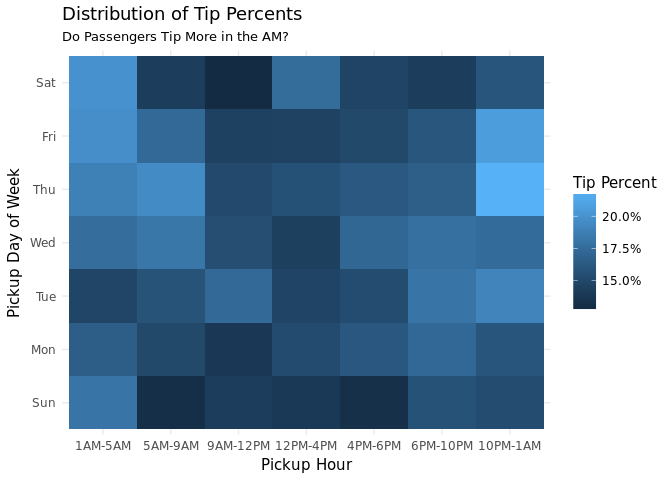
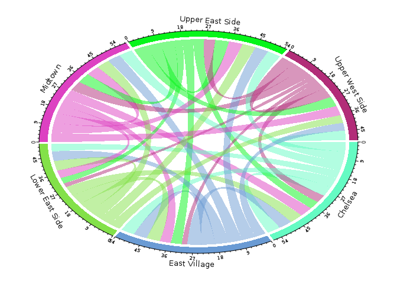
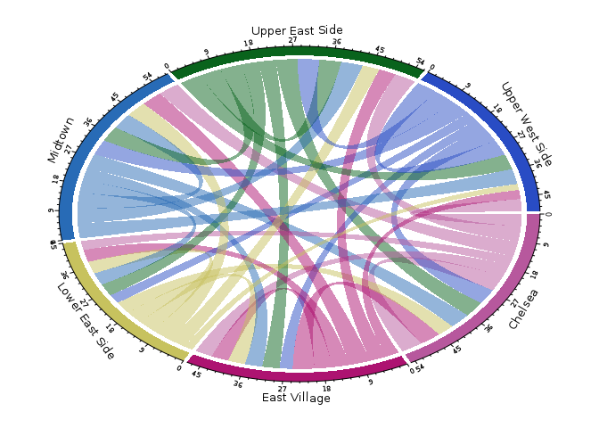
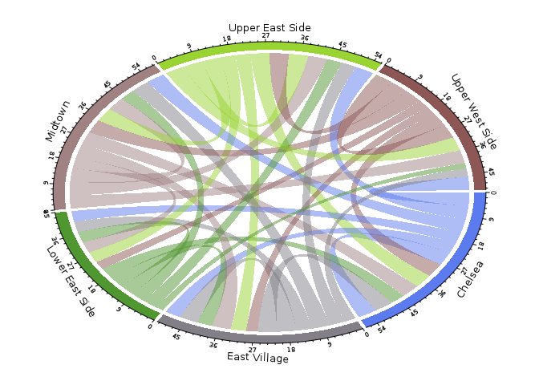
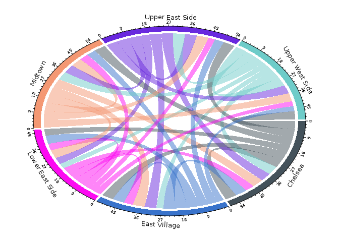
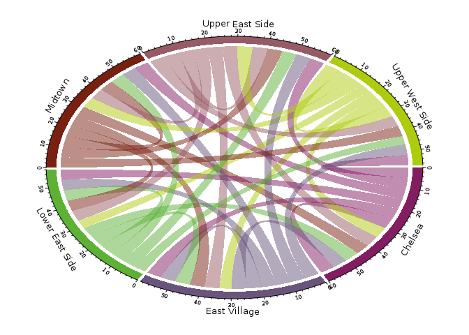
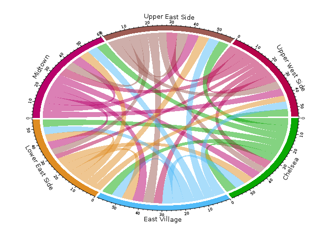

# Data Manipulation at Scale with Microsoft R Server and `RxSpark`
Ali Zaidi  
12/12/2016  


# Data Manipulation at Scale with Microsoft R Server and `RxSpark`

In a previous [post](blog.revolutionanalytics.com/2016/11/data-manipulation-with-sparklyr-on-azure-hdinsight.html) we showcased the use of the `sparklyr` package for manipulating large datasets using a familiar `dplyr` syntax on top of Spark HDInsight Clusters.

In this post, we will take a look at the `RxSpark` API for R, part of the `RevoScaleR` package and the Microsoft R Server distribution of R on HDInsight.

Dealing with data in distributed storage and programming with concurrent systems often requires learning complicated new paradigms and techniques. Statisticans and data scientists familiar wtih R are unlikely to have much experience with such systems. Fortunately, the `RevoScaleR` package abstracts away the difficult portions of distributed computation and allows the user to focus on building R code that can be automatically deployed in distributed environments.

## WODA - Write Once, Deploy Anywhere

In a similar spirit to how `sparklyr` allowed us to reuse our functions from the `dplyr` package to manipulate Spark DataFrames, the `RxSpark` API allows a data scientist to develop code that can  be deployed in a multitude of environments. This allows the developer to shift their focus from writing code that's specific to a certain environment, and instead focus on the complex analysis of their data science problem. We call this flexibility _Write Once, Deploy Anywhere_, or _WODA_ for the acronym lovers. 

For a deeper dive into the `RevoScaleR` package, I recommend you take a look at the online course, [Analyzing Big Data with Microsoft R Server](https://courses.edx.org/courses/course-v1:Microsoft+DAT213x+3T2016/info). Much of this blogpost follows along the last section of the course, on deployment to [Spark](https://smott.gitbooks.io/introduction-to-microsoft-r-server/content/41d-deploying-to-spark-demo.html).

## NYC Taxi Data

In this section, we will examine the ubiquitious [NYC Taxi Dataset](www.nyc.gov/html/tlc/html/about/trip_record_data.shtml), and showcase how we can develop data analysis pipelines that are platform invariant. 

As we will see in this post, we can reuse code that we developed in a local compute environment (i.e., a single machine), and have it deploy automagically in our new Spark environment. `RevoScaleR` will automatically transfer the computation from a single local machine to a network of concurrent systems, without requiring any concurrent expertise from the developer.

The aforementioned online course provides detailed examples of examining the NYC Taxi Dataset in a local _compute context_.  A _compute context_ is an object from the `RevoScaleR` package that describes a compute platform to inform `RevoScaleR` where to conduct its computations. By default, it is a `RxLocalSeq` environment, which means `RevoScaleR` will conduct it's analysis using the resources provided by the local machine, and do so in a sequential manner (i.e., if you have multiple jobs, these will be run sequentially, not in parallel). In our case, we have access to a cluster of machines on HDInsight, and a distributed compute platform through Spark, so we should inform `RevoScaleR` of our good fortunte and request it use more than just a single machine to do our computation. Fortunately, we can leverage the code directly from the course demonstrations, and apply it a larger dataset through Spark.

### Defining our Spark Compute Context

One of the major niceties of the `RevoScaleR` package is that it allows a developer to move seamlessly betweeen environments by simply specifying which compute platform the package should use for it's next computations. When you start working with `RevoScaleR`, you are working in a local compute context, which you can see by calling on the function: `rxGetComputeContext`:


```r
rxGetComputeContext()
```

```
## RxLocalSeq Compute Context
```

If you ever change your compute environment to a different platform, you can always revert back to a local compute context by simply setting the compute context back to "local":


```r
rxSetComputeContext("local")
```

In our case, we would like to work in a Spark compute context, which is defined by using the `RxSpark` object. Moreover, we also want to specify to `RevoScaleR` the location of our data store, which in this case, will be HDFS. This is done through the `RxHdfsFileSystem` object:


```r
hdfsFS <- RxHdfsFileSystem()

spark_cc <- RxSpark(
                    persistentRun = TRUE, 
                    extraSparkConfig = "--conf spark.speculation=true"
                    )
                          

rxSetComputeContext(spark_cc)

rxGetComputeContext()
```

```
## RevoScaleR Hadoop Spark Local Object
## ------------------------------------
## hdfsShareDir : "/user/RevoShare/alizaidi" 
## clientShareDir : "/tmp" 
## hadoopRPath : "/usr/bin/Revo64" 
## hadoopSwitches : "" 
## sshUsername : "alizaidi" 
## sshHostname : NULL 
## sshSwitches : "" 
## sshProfileScript : NULL 
## sshClientDir : "" 
## remoteMrsVersion : structure(list(major = 9L, minor = 0L, patch = 1L), .Names = c("major", "minor", "patch"), class = "version") 
## sshStrictHostKeyChecking : "ask" 
## usingRunAsUserMode : FALSE 
## nameNode : "default" 
## jobTrackerURL : NULL 
## port : 0 
## onClusterNode : TRUE 
## showOutputWhileWaiting : TRUE 
## fileSystem : NULL 
## numExecutors : 4 
## executorCores : 11 
## executorMem : "19280m" 
## driverMem : "4g" 
## executorOverheadMem : "19280m" 
## extraSparkConfig : "--conf spark.speculation=true" 
## idleTimeout : 3600 
## persistentRun : TRUE 
## sparkReduceMethod : "auto" 
## suppressWarning : TRUE 
## user : "alizaidi" 
## rSessionPid : 35863L 
## appId : "AEDDE1F030434FBE87411EE9F44BBB1E" 
## jobId : "" 
## shareDir : "/var/RevoShare/alizaidi" 
## revoPath : "/usr/bin/Revo64" 
## wait : TRUE 
## consoleOutput : FALSE 
## autoCleanup : TRUE 
## workingDir : NULL 
## dataPath : NULL 
## outDataPath : NULL 
## packagesToLoad : NULL 
## email : NULL 
## resultsTimeout : 15 
## description : "spark" 
## version : "1.0-1" 
## compatibilityRequest : <environment>
```

For simplicity, we have used all the default arguments when defining the Spark and HDFS environmental variables, except for insisting that `RevoScaleR` reuse the existing Spark application whenever possible (the `persistentRun` parameter), and that Spark attempt to restart tasks that appear to be lagging (the `extraSparkConfig` value).

Now that we have moved from a local environment to a Spark compute environment, our subsequent calls to `rx` functions will kick off a Spark application which will handle the distributed nature of our computations. For the developer/data scientist, we can proceed as though we were still working with a local machine, and allow `RevoScaleR` to handle the complexities of concurrent analysis.

Our data is saved in HDFS in the file path defined through the `taxi_path` object below. Let's first create a path to where we would like to save our **XDF** files and a pointer to our existing directory of **csv** files that we are hoping to import. Lastly, we will save a sample `data.frame` that we could use for testing:


```r
data_path <- file.path("/user/RevoShare/alizaidi")
taxi_path <- file.path(data_path, "nyctaxi/data")
hdfs_ls <- paste0("hadoop fs -ls ", taxi_path)
system(hdfs_ls)

taxi_xdf <- file.path(data_path, "TaxiXdf")

taxi_text <- RxTextData(taxi_path, fileSystem = hdfsFS)
taxi_xdf <- RxXdfData(taxi_xdf, fileSystem = hdfsFS)


### Also save a sample as a data.frame
nyc_sample_df <- read.csv("data/yellow_tripdata_2016-05.csv", nrows = 1000)
```

An **XDF** file is short for an external data frame, which is the fundamental data structure for `RevoScaleR` algorithms. It is an on-disk file object, that is optimized to work with `RevoScaleR`, and will be our default data structure for this blogpost. For more information about XDF objects, particularly when stored on HDFS, please take a look at the documentation [here](https://msdn.microsoft.com/en-us/microsoft-r/scaler-user-guide-data-import#importing-data-as-composite-xdf-files). 


Now that we have our pointers to the original data source (`taxi_text`), and the file path to where we want to save our data to (`taxi_xdf`), we can directly import our data using the simplest of `RevoScaleR` function:


```r
rxImport(inData = taxi_text, outFile = taxi_xdf)
```

Despite the fact that the data is stored in a set of directories partitioned across data nodes in a distributed cluster, our import step is the exact call that we would make when working with data stored locally!


```r
rxGetInfo(taxi_xdf, getVarInfo = TRUE, numRows = 5)
```

```
## File name: /user/RevoShare/alizaidi/TaxiXdf 
## Number of composite data files: 48 
## Number of observations: 138413407 
## Number of variables: 19 
## Number of blocks: 289 
## Compression type: zlib 
## Variable information: 
## Var 1: VendorID, Type: integer, Low/High: (1, 2)
## Var 2: tpep_pickup_datetime, Type: character
## Var 3: tpep_dropoff_datetime, Type: character
## Var 4: passenger_count, Type: integer, Low/High: (0, 9)
## Var 5: trip_distance, Type: numeric, Storage: float32, Low/High: (-3390583.7500, 198623008.0000)
## Var 6: pickup_longitude, Type: numeric, Storage: float32, Low/High: (-736.6166, 172.6000)
## Var 7: pickup_latitude, Type: numeric, Storage: float32, Low/High: (-78.1947, 80.6025)
## Var 8: RatecodeID, Type: integer, Low/High: (1, 99)
## Var 9: store_and_fwd_flag, Type: character
## Var 10: dropoff_longitude, Type: numeric, Storage: float32, Low/High: (-781.8333, 172.6000)
## Var 11: dropoff_latitude, Type: numeric, Storage: float32, Low/High: (-78.1947, 480.7333)
## Var 12: payment_type, Type: integer, Low/High: (1, 5)
## Var 13: fare_amount, Type: numeric, Storage: float32, Low/High: (-957.6000, 825998.6250)
## Var 14: extra, Type: numeric, Storage: float32, Low/High: (-58.5000, 648.8700)
## Var 15: mta_tax, Type: numeric, Storage: float32, Low/High: (-3.0000, 91.0000)
## Var 16: tip_amount, Type: numeric, Storage: float32, Low/High: (-440.0000, 1200.8000)
## Var 17: tolls_amount, Type: numeric, Storage: float32, Low/High: (-99.9900, 1901.4000)
## Var 18: improvement_surcharge, Type: numeric, Storage: float32, Low/High: (-0.3000, 137.6300)
## Var 19: total_amount, Type: numeric, Storage: float32, Low/High: (-958.4000, 826040.0000)
## Data (5 rows starting with row 1):
##   VendorID tpep_pickup_datetime tpep_dropoff_datetime passenger_count
## 1        1  2015-07-01 00:00:00   2015-07-01 00:15:26               1
## 2        1  2015-07-01 00:00:00   2015-07-01 00:22:22               1
## 3        1  2015-07-01 00:00:00   2015-07-01 00:07:42               1
## 4        1  2015-07-01 00:00:00   2015-07-01 00:39:37               1
## 5        1  2015-07-01 00:00:00   2015-07-01 00:05:34               1
##   trip_distance pickup_longitude pickup_latitude RatecodeID
## 1           3.5        -73.99416        40.75113          1
## 2           3.9        -73.98466        40.76849          1
## 3           2.3        -73.97889        40.76229          1
## 4           9.2        -73.99279        40.74276          1
## 5           1.1        -73.91243        40.76981          1
##   store_and_fwd_flag dropoff_longitude dropoff_latitude payment_type
## 1                  N         -73.97682         40.78857            2
## 2                  N         -74.00013         40.73490            2
## 3                  N         -74.00422         40.75253            2
## 4                  N         -73.97151         40.63715            1
## 5                  N         -73.92033         40.75744            1
##   fare_amount extra mta_tax tip_amount tolls_amount improvement_surcharge
## 1          14   0.5     0.5       0.00            0                   0.3
## 2          17   0.5     0.5       0.00            0                   0.3
## 3           9   0.5     0.5       0.00            0                   0.3
## 4          33   0.5     0.5       8.55            0                   0.3
## 5           6   0.5     0.5       2.00            0                   0.3
##   total_amount
## 1        15.30
## 2        18.30
## 3        10.30
## 4        42.85
## 5         9.30
```

Even though the data is now saved across multiple nodes in a distributed environment, the data is compressed in order to improve read performance, and metadata is saved, improving querying time for simple statsitics.


## Transformations with XDFDs

An important distinction with working with data stored in distributed file systems like HDFS in comparison to data residing on a single disk is it's _mutability_. In general, it's much more difficult to overwrite data in distributed storage, as it requires rewriting multiple non-contiguous blocks. 

Therefore, it is often better practice to write to a new location when working with XDFDs than to overwrite existing directories. The fundamental function for data manipulation with `RevoScaleR` is the `rxDataStep` function, and it adds new columns by taking in a list of transform expressions, as described in the example below:


```r
taxi_tip <- RxXdfData("/user/RevoShare/alizaidi/taxitipXdf",
                      fileSystem = hdfsFS)
```


```r
rxDataStep(taxi_xdf, taxi_tip,
           transforms = list(tip_percent = ifelse(fare_amount > 0, 
                                                  tip_amount/fare_amount,
                                                  NA)))
```

Examining results:


```r
rxGetInfo(taxi_tip, getVarInfo = TRUE)
```

```
## File name: /user/RevoShare/alizaidi/taxitipXdf 
## Number of composite data files: 48 
## Number of observations: 138413407 
## Number of variables: 20 
## Number of blocks: 289 
## Compression type: zlib 
## Variable information: 
## Var 1: VendorID, Type: integer, Low/High: (1, 2)
## Var 2: tpep_pickup_datetime, Type: character
## Var 3: tpep_dropoff_datetime, Type: character
## Var 4: passenger_count, Type: integer, Low/High: (0, 9)
## Var 5: trip_distance, Type: numeric, Storage: float32, Low/High: (-3390583.7500, 198623008.0000)
## Var 6: pickup_longitude, Type: numeric, Storage: float32, Low/High: (-736.6166, 172.6000)
## Var 7: pickup_latitude, Type: numeric, Storage: float32, Low/High: (-78.1947, 80.6025)
## Var 8: RatecodeID, Type: integer, Low/High: (1, 99)
## Var 9: store_and_fwd_flag, Type: character
## Var 10: dropoff_longitude, Type: numeric, Storage: float32, Low/High: (-781.8333, 172.6000)
## Var 11: dropoff_latitude, Type: numeric, Storage: float32, Low/High: (-78.1947, 480.7333)
## Var 12: payment_type, Type: integer, Low/High: (1, 5)
## Var 13: fare_amount, Type: numeric, Storage: float32, Low/High: (-957.6000, 825998.6250)
## Var 14: extra, Type: numeric, Storage: float32, Low/High: (-58.5000, 648.8700)
## Var 15: mta_tax, Type: numeric, Storage: float32, Low/High: (-3.0000, 91.0000)
## Var 16: tip_amount, Type: numeric, Storage: float32, Low/High: (-440.0000, 1200.8000)
## Var 17: tolls_amount, Type: numeric, Storage: float32, Low/High: (-99.9900, 1901.4000)
## Var 18: improvement_surcharge, Type: numeric, Storage: float32, Low/High: (-0.3000, 137.6300)
## Var 19: total_amount, Type: numeric, Storage: float32, Low/High: (-958.4000, 826040.0000)
## Var 20: tip_percent, Type: numeric, Low/High: (-1.0000, 54900.0012)
```


## More Complicated Transforms

### Creating Temporal Features

The above manipuluation previous sections how we could create new columns by defining a list of expressions. For more complicated data maipulation steps, we could create a user-defined functions (UDFs) that we could apply to each chunk of our data to create new columns. This greatly expands on the possibilities of data manipulation for large datasets, as we are no longer limited to handcrafting single expressions, we could create complex functions that could even rely on external R packages. The function below uses the `lubridate` package to create a set of columns defining some temporal features; the pickup/dropoff date, hour, day of week, as well as the trip duration:


```r
xforms <- function(data) { # transformation function for extracting some date and time features
  # require(lubridate)
  weekday_labels <- c('Sun', 'Mon', 'Tue', 'Wed', 'Thu', 'Fri', 'Sat')
  cut_levels <- c(1, 5, 9, 12, 16, 18, 22)
  hour_labels <- c('1AM-5AM', '5AM-9AM', '9AM-12PM', '12PM-4PM', '4PM-6PM', '6PM-10PM', '10PM-1AM')
  
  pickup_datetime <- lubridate::ymd_hms(data$tpep_pickup_datetime, tz = "UTC")
  pickup_hour <- addNA(cut(hour(pickup_datetime), cut_levels))
  pickup_dow <- factor(wday(pickup_datetime), levels = 1:7, labels = weekday_labels)
  levels(pickup_hour) <- hour_labels
  # 
  dropoff_datetime <- lubridate::ymd_hms(data$tpep_dropoff_datetime, tz = "UTC")
  dropoff_hour <- addNA(cut(hour(dropoff_datetime), cut_levels))
  dropoff_dow <- factor(wday(dropoff_datetime), levels = 1:7, labels = weekday_labels)
  levels(dropoff_hour) <- hour_labels
  # 
  data$pickup_hour <- pickup_hour
  data$pickup_dow <- pickup_dow
  data$dropoff_hour <- dropoff_hour
  data$dropoff_dow <- dropoff_dow
  data$trip_duration <- as.integer(lubridate::interval(pickup_datetime, dropoff_datetime))
  
  return(data)
}
```

We defined our function above, and now we apply it to our dataset. In order to ensure our function works on our data, we could try it out on a sample dataset locally first by reverting to a local compute context:


```r
x <- head(taxi_tip)
rxSetComputeContext("local")

rxDataStep(inData = x, 
           outFile = NULL, 
           transformFunc = xforms, 
           transformPackages = "lubridate")
```

```
##   VendorID tpep_pickup_datetime tpep_dropoff_datetime passenger_count
## 1        1  2015-07-01 00:00:00   2015-07-01 00:15:26               1
## 2        1  2015-07-01 00:00:00   2015-07-01 00:22:22               1
## 3        1  2015-07-01 00:00:00   2015-07-01 00:07:42               1
## 4        1  2015-07-01 00:00:00   2015-07-01 00:39:37               1
## 5        1  2015-07-01 00:00:00   2015-07-01 00:05:34               1
## 6        1  2015-07-01 00:00:00   2015-07-01 00:06:46               2
##   trip_distance pickup_longitude pickup_latitude RatecodeID
## 1           3.5        -73.99416        40.75113          1
## 2           3.9        -73.98466        40.76849          1
## 3           2.3        -73.97889        40.76229          1
## 4           9.2        -73.99279        40.74276          1
## 5           1.1        -73.91243        40.76981          1
## 6           1.0        -73.95916        40.77343          1
##   store_and_fwd_flag dropoff_longitude dropoff_latitude payment_type
## 1                  N         -73.97682         40.78857            2
## 2                  N         -74.00013         40.73490            2
## 3                  N         -74.00422         40.75253            2
## 4                  N         -73.97151         40.63715            1
## 5                  N         -73.92033         40.75744            1
## 6                  N         -73.96935         40.76925            2
##   fare_amount extra mta_tax tip_amount tolls_amount improvement_surcharge
## 1        14.0   0.5     0.5       0.00            0                   0.3
## 2        17.0   0.5     0.5       0.00            0                   0.3
## 3         9.0   0.5     0.5       0.00            0                   0.3
## 4        33.0   0.5     0.5       8.55            0                   0.3
## 5         6.0   0.5     0.5       2.00            0                   0.3
## 6         6.5   0.5     0.5       0.00            0                   0.3
##   total_amount tip_percent pickup_hour pickup_dow dropoff_hour dropoff_dow
## 1        15.30   0.0000000    10PM-1AM        Wed     10PM-1AM         Wed
## 2        18.30   0.0000000    10PM-1AM        Wed     10PM-1AM         Wed
## 3        10.30   0.0000000    10PM-1AM        Wed     10PM-1AM         Wed
## 4        42.85   0.2590909    10PM-1AM        Wed     10PM-1AM         Wed
## 5         9.30   0.3333333    10PM-1AM        Wed     10PM-1AM         Wed
## 6         7.80   0.0000000    10PM-1AM        Wed     10PM-1AM         Wed
##   trip_duration
## 1           926
## 2          1342
## 3           462
## 4          2377
## 5           334
## 6           406
```

```r
rxSetComputeContext(spark_cc)
```

We used a local compute context to try our function on the sample locally, then reverted to the spark context for doing our analysis on the cluster.


```r
taxi_date <- RxXdfData("/user/RevoShare/alizaidi/TaxiDatesTranf",
                       fileSystem = hdfsFS)
```


```r
rxDataStep(inData = taxi_tip, 
           outFile = taxi_date, 
           transformFunc = xforms, 
           transformPackages = "lubridate")
```


```r
rxGetInfo(taxi_date, numRows = 5, getVarInfo = TRUE)
```

```
## File name: /user/RevoShare/alizaidi/TaxiDatesTranf 
## Number of composite data files: 48 
## Number of observations: 138413407 
## Number of variables: 25 
## Number of blocks: 289 
## Compression type: zlib 
## Variable information: 
## Var 1: VendorID, Type: integer, Low/High: (1, 2)
## Var 2: tpep_pickup_datetime, Type: character
## Var 3: tpep_dropoff_datetime, Type: character
## Var 4: passenger_count, Type: integer, Low/High: (0, 9)
## Var 5: trip_distance, Type: numeric, Storage: float32, Low/High: (-3390583.7500, 198623008.0000)
## Var 6: pickup_longitude, Type: numeric, Storage: float32, Low/High: (-736.6166, 172.6000)
## Var 7: pickup_latitude, Type: numeric, Storage: float32, Low/High: (-78.1947, 80.6025)
## Var 8: RatecodeID, Type: integer, Low/High: (1, 99)
## Var 9: store_and_fwd_flag, Type: character
## Var 10: dropoff_longitude, Type: numeric, Storage: float32, Low/High: (-781.8333, 172.6000)
## Var 11: dropoff_latitude, Type: numeric, Storage: float32, Low/High: (-78.1947, 480.7333)
## Var 12: payment_type, Type: integer, Low/High: (1, 5)
## Var 13: fare_amount, Type: numeric, Storage: float32, Low/High: (-957.6000, 825998.6250)
## Var 14: extra, Type: numeric, Storage: float32, Low/High: (-58.5000, 648.8700)
## Var 15: mta_tax, Type: numeric, Storage: float32, Low/High: (-3.0000, 91.0000)
## Var 16: tip_amount, Type: numeric, Storage: float32, Low/High: (-440.0000, 1200.8000)
## Var 17: tolls_amount, Type: numeric, Storage: float32, Low/High: (-99.9900, 1901.4000)
## Var 18: improvement_surcharge, Type: numeric, Storage: float32, Low/High: (-0.3000, 137.6300)
## Var 19: total_amount, Type: numeric, Storage: float32, Low/High: (-958.4000, 826040.0000)
## Var 20: tip_percent, Type: numeric, Low/High: (-1.0000, 54900.0012)
## Var 21: pickup_hour
##        7 factor levels: 1AM-5AM 5AM-9AM 9AM-12PM 12PM-4PM 4PM-6PM 6PM-10PM 10PM-1AM
## Var 22: pickup_dow
##        7 factor levels: Sun Mon Tue Wed Thu Fri Sat
## Var 23: dropoff_hour
##        7 factor levels: 1AM-5AM 5AM-9AM 9AM-12PM 12PM-4PM 4PM-6PM 6PM-10PM 10PM-1AM
## Var 24: dropoff_dow
##        7 factor levels: Sun Mon Tue Wed Thu Fri Sat
## Var 25: trip_duration, Type: integer, Low/High: (-631148790, 29227264)
## Data (5 rows starting with row 1):
##   VendorID tpep_pickup_datetime tpep_dropoff_datetime passenger_count
## 1        1  2015-07-01 00:00:00   2015-07-01 00:15:26               1
## 2        1  2015-07-01 00:00:00   2015-07-01 00:22:22               1
## 3        1  2015-07-01 00:00:00   2015-07-01 00:07:42               1
## 4        1  2015-07-01 00:00:00   2015-07-01 00:39:37               1
## 5        1  2015-07-01 00:00:00   2015-07-01 00:05:34               1
##   trip_distance pickup_longitude pickup_latitude RatecodeID
## 1           3.5        -73.99416        40.75113          1
## 2           3.9        -73.98466        40.76849          1
## 3           2.3        -73.97889        40.76229          1
## 4           9.2        -73.99279        40.74276          1
## 5           1.1        -73.91243        40.76981          1
##   store_and_fwd_flag dropoff_longitude dropoff_latitude payment_type
## 1                  N         -73.97682         40.78857            2
## 2                  N         -74.00013         40.73490            2
## 3                  N         -74.00422         40.75253            2
## 4                  N         -73.97151         40.63715            1
## 5                  N         -73.92033         40.75744            1
##   fare_amount extra mta_tax tip_amount tolls_amount improvement_surcharge
## 1          14   0.5     0.5       0.00            0                   0.3
## 2          17   0.5     0.5       0.00            0                   0.3
## 3           9   0.5     0.5       0.00            0                   0.3
## 4          33   0.5     0.5       8.55            0                   0.3
## 5           6   0.5     0.5       2.00            0                   0.3
##   total_amount tip_percent pickup_hour pickup_dow dropoff_hour dropoff_dow
## 1        15.30   0.0000000    10PM-1AM        Wed     10PM-1AM         Wed
## 2        18.30   0.0000000    10PM-1AM        Wed     10PM-1AM         Wed
## 3        10.30   0.0000000    10PM-1AM        Wed     10PM-1AM         Wed
## 4        42.85   0.2590909    10PM-1AM        Wed     10PM-1AM         Wed
## 5         9.30   0.3333333    10PM-1AM        Wed     10PM-1AM         Wed
##   trip_duration
## 1           926
## 2          1342
## 3           462
## 4          2377
## 5           334
```


As you see from the output of the chunk above, our function create a set of columns defining some useful temporal features. Our hope is that these temporal features will give us a better understanding of the distribution of trips as a function of temporal variables.

For example, we can now examine how the distribution of tip percents vary as a function of day of week and pickup hour:


```r
tip_dist_df <- rxCube(tip_percent ~ pickup_hour + pickup_dow, data = taxi_date, returnDataFrame = TRUE)

library(ggplot2)
library(magrittr)

tip_dist_df %>% ggplot(aes(x = pickup_hour, y = pickup_dow, fill = tip_percent)) +
  geom_tile() + theme_minimal() + 
  scale_fill_continuous(label = scales::percent) +
  labs(x = "Pickup Hour", y = "Pickup Day of Week", fill = "Tip Percent",
      title = "Distribution of Tip Percents",
      subtitle = "Do Passengers Tip More in the AM?")
```




### Crafting Spatial Features

While temporal features give us an interesting look at how taxi trips vary as a function of time, the trips data contains a wealth of information about spatial features. Currently, the spatial features are all consolidated into the coordinates columns, which are numeric values. In order to reduce the variability of the numeric features, and encode them into more sensible categories, let's see if we can transform the coordinate columns into a column of categorical features encoding the neighborhood of pickup and dropoff.


Our UDF will examine the rows of our data set, and map the spatial coordinates to a shapefile that contains the neighborhoods of NYC. The shapefile we will use is from [Zillow](http://www.zillow.com/static/shp/ZillowNeighborhoods-NY.zip):


```r
library(rgeos)
library(sp)
library(maptools)
library(stringr)

nyc_shapefile <- readShapePoly('ZillowNeighborhoods-NY/ZillowNeighborhoods-NY.shp')
mht_shapefile <- subset(nyc_shapefile, str_detect(CITY, 'New York City-Manhattan'))

mht_shapefile@data$id <- as.character(mht_shapefile@data$NAME)
```

We will use the shapefile to map the spatial coordinates of our obsevations to the nearest neighborhood given by the shapefile:


```r
find_nhoods <- function(data) {
  
  # extract pick-up lat and long and find their neighborhoods
  pickup_longitude <- ifelse(is.na(data$pickup_longitude), 0, data$pickup_longitude)
  pickup_latitude <- ifelse(is.na(data$pickup_latitude), 0, data$pickup_latitude)
  data_coords <- data.frame(long = pickup_longitude, lat = pickup_latitude)
  coordinates(data_coords) <- c('long', 'lat')
  nhoods <- over(data_coords, shapefile)
  
  ## add only the pick-up neighborhood and city columns to the data
  data$pickup_nhood <- nhoods$NAME
  data$pickup_borough <- nhoods$CITY
  
  # extract drop-off lat and long and find their neighborhoods
  dropoff_longitude <- ifelse(is.na(data$dropoff_longitude), 0, data$dropoff_longitude)
  dropoff_latitude <- ifelse(is.na(data$dropoff_latitude), 0, data$dropoff_latitude)
  data_coords <- data.frame(long = dropoff_longitude, lat = dropoff_latitude)
  coordinates(data_coords) <- c('long', 'lat')
  nhoods <- over(data_coords, shapefile)
  
  ## add only the drop-off neighborhood and city columns to the data  
  data$dropoff_nhood <- nhoods$NAME
  data$dropoff_borough <- nhoods$CITY
  
  ## return the data with the new columns added in
  data
}
```

Let's again test this function locally first:


```r
rxSetComputeContext("local")

head(rxDataStep(nyc_sample_df, transformFunc = find_nhoods, transformPackages = c("sp", "maptools"), 
                transformObjects = list(shapefile = mht_shapefile)))
```

```
##   VendorID tpep_pickup_datetime tpep_dropoff_datetime passenger_count
## 1        1  2016-05-01 00:00:00   2016-05-01 00:17:31               1
## 2        2  2016-05-01 00:00:00   2016-05-01 00:07:31               1
## 3        2  2016-05-01 00:00:00   2016-05-01 00:07:01               6
## 4        2  2016-05-01 00:00:00   2016-05-01 00:19:47               1
## 5        2  2016-05-01 00:00:00   2016-05-01 00:06:39               1
## 6        2  2016-05-01 00:00:00   2016-05-01 00:05:19               2
##   trip_distance pickup_longitude pickup_latitude RatecodeID
## 1          3.60        -73.98590        40.76804          1
## 2          1.68        -73.99158        40.74475          1
## 3          1.09        -73.99307        40.74157          1
## 4          4.21        -73.99194        40.68460          1
## 5          0.56        -74.00528        40.74019          1
## 6          0.63        -73.97929        40.75576          1
##   store_and_fwd_flag dropoff_longitude dropoff_latitude payment_type
## 1                  N         -73.98399         40.73010            1
## 2                  N         -73.97570         40.76547            1
## 3                  N         -73.98100         40.74463            1
## 4                  N         -74.00226         40.73300            1
## 5                  N         -73.99750         40.73756            1
## 6                  N         -73.98801         40.75847            1
##   fare_amount extra mta_tax tip_amount tolls_amount improvement_surcharge
## 1        15.0   0.5     0.5       1.50            0                   0.3
## 2         7.5   0.5     0.5       0.88            0                   0.3
## 3         6.5   0.5     0.5       1.56            0                   0.3
## 4        17.0   0.5     0.5       3.66            0                   0.3
## 5         6.0   0.5     0.5       1.46            0                   0.3
## 6         5.0   0.5     0.5       0.00            0                   0.3
##   total_amount pickup_nhood          pickup_borough     dropoff_nhood
## 1        17.80      Midtown New York City-Manhattan      East Village
## 2         9.68      Chelsea New York City-Manhattan      Central Park
## 3         9.36      Chelsea New York City-Manhattan          Gramercy
## 4        21.96         <NA>                    <NA> Greenwich Village
## 5         8.76 West Village New York City-Manhattan Greenwich Village
## 6         6.30      Midtown New York City-Manhattan           Midtown
##           dropoff_borough
## 1 New York City-Manhattan
## 2 New York City-Manhattan
## 3 New York City-Manhattan
## 4 New York City-Manhattan
## 5 New York City-Manhattan
## 6 New York City-Manhattan
```

```r
rxSetComputeContext(spark_cc)
```

Looks like it worked locally, let's try it on our full dataset:


```r
taxi_hoods <- RxXdfData("/user/RevoShare/alizaidi/TaxiHoodsXdf",
                       fileSystem = hdfsFS)
```


```r
rxDataStep(taxi_date, taxi_hoods, 
           transformFunc = find_nhoods, 
           transformPackages = c("sp", "maptools", "rgeos"), 
           transformObjects = list(shapefile = mht_shapefile))
```


```r
rxGetInfo(taxi_hoods, numRows = 5)
```

```
## File name: /user/RevoShare/alizaidi/TaxiHoodsXdf 
## Number of composite data files: 48 
## Number of observations: 138413407 
## Number of variables: 29 
## Number of blocks: 289 
## Compression type: zlib 
## Data (5 rows starting with row 1):
##   VendorID tpep_pickup_datetime tpep_dropoff_datetime passenger_count
## 1        1  2015-07-01 00:00:00   2015-07-01 00:15:26               1
## 2        1  2015-07-01 00:00:00   2015-07-01 00:22:22               1
## 3        1  2015-07-01 00:00:00   2015-07-01 00:07:42               1
## 4        1  2015-07-01 00:00:00   2015-07-01 00:39:37               1
## 5        1  2015-07-01 00:00:00   2015-07-01 00:05:34               1
##   trip_distance pickup_longitude pickup_latitude RatecodeID
## 1           3.5        -73.99416        40.75113          1
## 2           3.9        -73.98466        40.76849          1
## 3           2.3        -73.97889        40.76229          1
## 4           9.2        -73.99279        40.74276          1
## 5           1.1        -73.91243        40.76981          1
##   store_and_fwd_flag dropoff_longitude dropoff_latitude payment_type
## 1                  N         -73.97682         40.78857            2
## 2                  N         -74.00013         40.73490            2
## 3                  N         -74.00422         40.75253            2
## 4                  N         -73.97151         40.63715            1
## 5                  N         -73.92033         40.75744            1
##   fare_amount extra mta_tax tip_amount tolls_amount improvement_surcharge
## 1          14   0.5     0.5       0.00            0                   0.3
## 2          17   0.5     0.5       0.00            0                   0.3
## 3           9   0.5     0.5       0.00            0                   0.3
## 4          33   0.5     0.5       8.55            0                   0.3
## 5           6   0.5     0.5       2.00            0                   0.3
##   total_amount tip_percent pickup_hour pickup_dow dropoff_hour dropoff_dow
## 1        15.30   0.0000000    10PM-1AM        Wed     10PM-1AM         Wed
## 2        18.30   0.0000000    10PM-1AM        Wed     10PM-1AM         Wed
## 3        10.30   0.0000000    10PM-1AM        Wed     10PM-1AM         Wed
## 4        42.85   0.2590909    10PM-1AM        Wed     10PM-1AM         Wed
## 5         9.30   0.3333333    10PM-1AM        Wed     10PM-1AM         Wed
##   trip_duration     pickup_nhood          pickup_borough     dropoff_nhood
## 1           926 Garment District New York City-Manhattan   Upper West Side
## 2          1342          Midtown New York City-Manhattan Greenwich Village
## 3           462          Midtown New York City-Manhattan           Chelsea
## 4          2377          Chelsea New York City-Manhattan              <NA>
## 5           334             <NA>                    <NA>              <NA>
##           dropoff_borough
## 1 New York City-Manhattan
## 2 New York City-Manhattan
## 3 New York City-Manhattan
## 4                    <NA>
## 5                    <NA>
```

### Filter Data to Manhattan Only

Since Manhattan is the busiest of boroughs in NYC, we will narrow our focus to do the trips that started and ended in that borough. Moreover, we will take advantage to filter out possible outlier observations as well:


```r
mht_xdf <- RxXdfData("/user/RevoShare/alizaidi/ManhattanXdf",
                     fileSystem = hdfsFS)
```


```r
rxDataStep(mht_hoods, mht_xdf, 
           rowSelection = (
             passenger_count > 0 &
               trip_distance >= 0 & trip_distance < 30 &
               trip_duration > 0 & trip_duration < 60*60*24 &
               str_detect(pickup_borough, 'Manhattan') &
               str_detect(dropoff_borough, 'Manhattan') &
               !is.na(pickup_nb) &
               !is.na(dropoff_nb) &
               fare_amount > 0), 
           transformPackages = "stringr",
           varsToDrop = c('extra', 'mta_tax', 'improvement_surcharge', 'total_amount', 
                          'pickup_borough', 'dropoff_borough', 'pickup_nhood', 'dropoff_nhood'))
```

Now that we have our spatial features, let's see if we can make a visualization of the trips as a function time of trip as well as the trip route.


```r
library(dplyr)

nbs_df <- rxCube(~ pickup_nb + dropoff_nb + pickup_hour, data = mht_xdf, returnDataFrame = TRUE)
nbs_df <- nbs_df %>% tbl_df %>%
  filter(Counts >= 100) %>% 
  mutate(width = ntile(Counts, 5))
```


We used the beloved `dplyr` package in conjuction with the `RevoScaleR` `rxCube` function to tabulate the counts of trips as a function of route and pickup hour, and then filtered to only those routes that had at least 100 observations in our dataset. Finally, we used the handy `ntile` function in `dplyr` to create a variable to measure the strength of relationship of pickup and dropoff neighborhoods as a 20% percentile of all trips. 


Now that we have the counts in a tidy `data.frame` object, we can make visualizations of the route. We'll use the exceptional [`circlize`](https://github.com/jokergoo/circlize) package to make visualizations, one for each level of the `pickup_hour` factor. In order to map each of these to the visualization, we will first make a _functional sequence_ which will contain the methods to make our visualization, and then use the [`purrr`](github.com/hadley/purrr) package to map each level of the factor column into the functional sequence. In order to make our plots a little less "hair-ballish", we'll narrow our focus to a few of the most popular neighborhoods, as specified through the `nbs` vector (please don't be offended if your favorite neighborhood was ommitted):


```r
library(purrr)
library(circlize)

nbs <- c("Lower East Side","East Village",
          "Chelsea", "Midtown", "Upper East Side",
         "Upper West Side", "Greenwich Vilalge")


chord_diag <- . %>% select(pickup_nb, dropoff_nb, width) %>% chordDiagram()

chord_plot <- nbs_df %>%
  filter(pickup_nb %in% nbs,
         dropoff_nb %in% nbs) %>% 
  split(.$pickup_hour) %>%
  map(chord_diag)
```



## Conclusion

Hopefully this post provided some insight on how we could `RevoScaleR` to develop scalable data analysis pipelines that can be deployed onto Spark clusters easily. We developed some intuitive features from our data set based on temporal and spatial characteristics of the original data. Stay tuned for another post where we show how you can use these features for prediction and inference!

